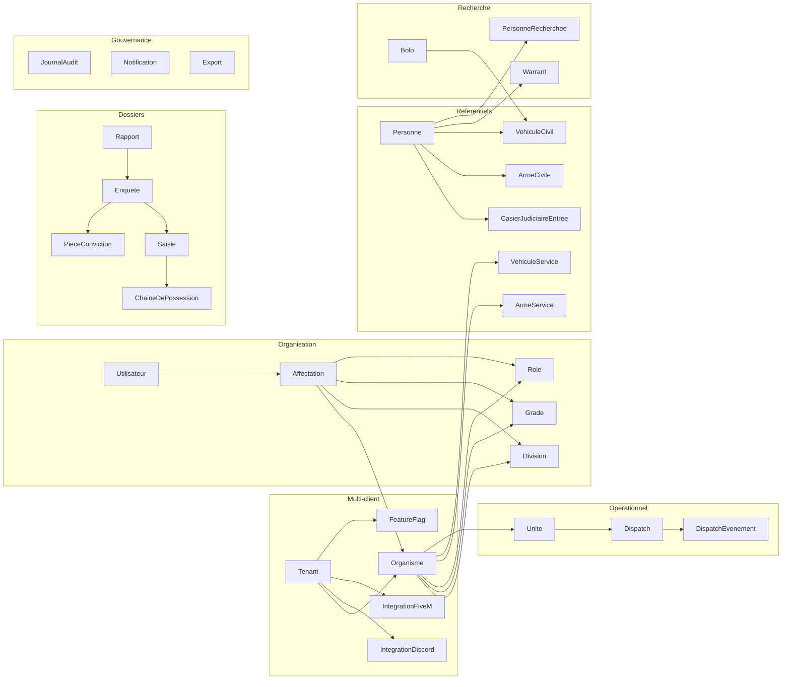

# Schéma de base de données v1

> Livrable de la section 9 du cahier des charges (`../prompt-panel-fivem-dispatch.md`). Reflète les décisions des sections 0 et 0.1. PostgreSQL + Prisma, syntaxe Prisma utilisée comme notation de référence — ce fichier n'est pas branché sur une application, c'est un livrable de cadrage à copier dans `apps/api/prisma/schema.prisma` une fois validé.

## Conventions de nommage

- Tables et modèles en `PascalCase` singulier, colonnes en `camelCase`.
- Toute table métier porte `tenantId` (sauf `Tenant` lui-même), utilisé pour l'isolation applicative **et** pour les policies PostgreSQL Row-Level Security (voir section 10, doc RLS).
- Toute table portant des données rattachées à un organisme porte aussi `organismeId`, nullable seulement quand la donnée est réellement transverse au tenant (ex. `Personne`, `Notification`).
- Champs communs à toute entité métier : `id` (uuid), `createdAt`, `updatedAt`, `createdById` quand un auteur a du sens, `deletedAt` pour l'archivage/suppression logique (jamais de suppression physique en dehors de RGPD explicite).
- Les identifiants étrangers vers une autre table du même groupe sont suffixés `Id`. Les enums sont préfixés par leur domaine pour rester lisibles dans les migrations (`RapportStatut`, `DispatchStatut`, ...).
- Les liens polymorphes (pièce jointe, commentaire, historique) utilisent un couple `(cibleType, cibleId)` plutôt qu'une table de jointure par type, pour ne pas dupliquer les tables à l'infini (cf. section 3.4 du cahier des charges).

## Vue d'ensemble par groupe



## Multi-client

```prisma
enum HostingMode {
  SAAS
  DEDICATED
}

enum LicenseType {
  TRIAL
  MONTHLY
  LIFETIME
}

enum LicenseStatus {
  TRIALING
  ACTIVE
  PAST_DUE
  SUSPENDED
  CANCELLED
}

model Tenant {
  id                String        @id @default(uuid())
  name              String
  slug              String        @unique
  hostingMode       HostingMode
  licenseType       LicenseType
  licenseStatus     LicenseStatus
  licenseExpiresAt  DateTime?
  maxOrganismes     Int           @default(1) // paliers d'offre, cf. décision Q4
  createdAt         DateTime      @default(now())
  updatedAt         DateTime      @updatedAt

  organismes         Organisme[]
  utilisateurs       Utilisateur[]
  featureFlags       FeatureFlag[]
  integrationDiscord IntegrationDiscord?
  integrationFiveM   IntegrationFiveM[]   // un par serveur si un client gère plusieurs adaptateurs de test
  journalAudit       JournalAudit[]
}

model FeatureFlag {
  id       String  @id @default(uuid())
  tenantId String
  key      String
  enabled  Boolean @default(false)

  tenant Tenant @relation(fields: [tenantId], references: [id])

  @@unique([tenantId, key])
}
```

## Organisation

```prisma
enum OrganismeStatut {
  ACTIF
  ARCHIVE
}

model Organisme {
  id           String          @id @default(uuid())
  tenantId     String
  nom          String
  nomCourt     String
  code         String          // ex. LSPD, SAHP, USMS
  couleur      String?
  logoUrl      String?
  juridiction  String?
  statut       OrganismeStatut @default(ACTIF)
  createdAt    DateTime        @default(now())
  updatedAt    DateTime        @updatedAt

  tenant       Tenant        @relation(fields: [tenantId], references: [id])
  divisions    Division[]
  grades       Grade[]
  roles        Role[]
  affectations Affectation[]

  @@unique([tenantId, code])
}

model Division {
  id            String   @id @default(uuid())
  tenantId      String
  organismeId   String
  nom           String   // ex. Gang Task Force, K-9, SWAT, CID, enquêteurs
  code          String
  description   String?
  parentId      String?  // hiérarchie de division optionnelle

  organisme Organisme  @relation(fields: [organismeId], references: [id])
  parent    Division?  @relation("DivisionHierarchie", fields: [parentId], references: [id])
  enfants   Division[] @relation("DivisionHierarchie")

  @@unique([organismeId, code])
}

model Grade {
  id          String @id @default(uuid())
  tenantId    String
  organismeId String
  nom         String
  niveau      Int    // ordre d'affichage / hiérarchie, purement visuel (décision Q8)
  icone       String?

  organisme Organisme @relation(fields: [organismeId], references: [id])

  @@unique([organismeId, niveau])
}

model Permission {
  id          String @id @default(uuid())
  cle         String @unique // ex. "rapport.approuver", "casier.gerer"
  categorie   String
  description String

  rolePermissions RolePermission[]
}

model Role {
  id          String  @id @default(uuid())
  tenantId    String
  organismeId String
  nom         String
  estSysteme  Boolean @default(false)

  organisme       Organisme        @relation(fields: [organismeId], references: [id])
  rolePermissions RolePermission[]
  affectations    Affectation[]
}

enum PermissionScope {
  SOI
  DIVISION
  ORGANISME
  TENANT
}

model RolePermission {
  roleId       String
  permissionId String
  scope        PermissionScope

  role       Role       @relation(fields: [roleId], references: [id])
  permission Permission @relation(fields: [permissionId], references: [id])

  @@id([roleId, permissionId])
}

model Utilisateur {
  id           String   @id @default(uuid())
  tenantId     String
  discordId    String   // connexion via Discord OAuth, décision Q6
  email        String?
  mfaEnabled   Boolean  @default(false)
  mfaRequired  Boolean  @default(false) // dérivé des permissions de ses affectations (décision Q10)
  createdAt    DateTime @default(now())

  tenant       Tenant        @relation(fields: [tenantId], references: [id])
  affectations Affectation[]

  @@unique([tenantId, discordId])
}

enum AffectationStatut {
  ACTIVE
  SUSPENDUE
  ARCHIVEE
}

// Une ligne par organisme auquel appartient l'utilisateur (décision Q7 : multi-appartenance)
model Affectation {
  id           String             @id @default(uuid())
  tenantId     String
  utilisateurId String
  organismeId  String
  divisionId   String?
  gradeId      String?
  roleId       String
  matricule    String?
  indicatif    String?
  estPrincipale Boolean           @default(false)
  statut       AffectationStatut  @default(ACTIVE)
  debutAt      DateTime           @default(now())
  finAt        DateTime?

  tenant      Tenant      @relation(fields: [tenantId], references: [id])
  utilisateur Utilisateur @relation(fields: [utilisateurId], references: [id])
  organisme   Organisme   @relation(fields: [organismeId], references: [id])
  division    Division?   @relation(fields: [divisionId], references: [id])
  grade       Grade?      @relation(fields: [gradeId], references: [id])
  role        Role        @relation(fields: [roleId], references: [id])

  @@unique([utilisateurId, organismeId])
}
```

## Référentiels RP (personnes, casier, armes, véhicules)

```prisma
model Personne {
  id            String   @id @default(uuid())
  tenantId      String
  nom           String
  prenom        String
  dateNaissance DateTime
  taille        Int      // cm
  nationalite   String
  fivemCharId   String?  // identité synchronisée depuis le framework FiveM, décision Q12
  fivemLicense  String?
  champsPerso   Json     @default("{}")
  createdAt     DateTime @default(now())
  updatedAt     DateTime @updatedAt

  casier          CasierJudiciaireEntree[]
  armesCivilesPossedees ArmeCivile[]
  vehiculesPossedes     VehiculeCivil[]
  warrants        Warrant[]
  recherches      PersonneRecherchee[]

  @@index([tenantId, nom, prenom])
  @@unique([tenantId, fivemCharId])
}

enum CasierStatut {
  EN_COURS
  PURGEE
  GRACIEE
  AMNISTIEE
}

model CasierJudiciaireEntree {
  id             String       @id @default(uuid())
  tenantId       String
  personneId     String
  motif          String
  qualification  String
  peine          String
  date           DateTime
  autoriteRp     String
  statut         CasierStatut @default(EN_COURS)
  sourceRapportId String?
  sourceWarrantId String?
  sourceEnqueteId String?
  createdById    String       // permission "casier.gerer" requise, décision Q34
  createdAt      DateTime     @default(now())

  personne Personne @relation(fields: [personneId], references: [id])

  @@index([tenantId, personneId])
}

enum ObjetStatut {
  EN_CIRCULATION
  SAISI
  DETRUIT
}

model ArmeCivile {
  id                String      @id @default(uuid())
  tenantId          String
  numeroSerie       String
  modele            String
  statut            ObjetStatut @default(EN_CIRCULATION)
  proprietaireId    String?

  proprietaire Personne? @relation(fields: [proprietaireId], references: [id])

  @@unique([tenantId, numeroSerie])
}

model ArmeService {
  id            String      @id @default(uuid())
  tenantId      String
  organismeId   String
  numeroSerie   String
  modele        String
  statut        ObjetStatut @default(EN_CIRCULATION)
  assigneeId    String?     // Affectation.id du membre porteur

  @@unique([tenantId, numeroSerie])
}

model VehiculeCivil {
  id             String      @id @default(uuid())
  tenantId       String
  plaque         String
  modele         String
  couleur        String
  statut         ObjetStatut @default(EN_CIRCULATION)
  proprietaireId String?

  proprietaire Personne? @relation(fields: [proprietaireId], references: [id])
  bolos        Bolo[]

  @@unique([tenantId, plaque])
}

model VehiculeService {
  id           String      @id @default(uuid())
  tenantId     String
  organismeId  String
  plaque       String
  modele       String
  statutFlotte ObjetStatut @default(EN_CIRCULATION)
  assigneeId   String?     // Unite.id courante

  @@unique([tenantId, plaque])
}

model Lieu {
  id                String  @id @default(uuid())
  tenantId          String
  nom               String
  coordonneesSvg    Json
  coordonneesFiveM  Json?
  description       String?
}
```

## Warrants, personnes recherchées, BOLO

```prisma
enum WarrantStatut {
  BROUILLON
  EN_ATTENTE_VISA
  APPROUVE
  REJETE
  EXPIRE
  ANNULE
}

model Warrant {
  id              String        @id @default(uuid())
  tenantId        String
  organismeId     String
  personneId      String
  motif           String
  statut          WarrantStatut @default(BROUILLON)
  auteurId        String
  approbateurId   String?       // visa obligatoire, décision Q23
  dateEmission    DateTime?
  dateExpiration  DateTime?

  personne Personne @relation(fields: [personneId], references: [id])
}

enum RechercheStatut {
  ACTIVE
  SUSPENDUE
  CLOTUREE
}

model PersonneRecherchee {
  id          String          @id @default(uuid())
  tenantId    String
  organismeId String
  personneId  String
  niveau      String
  motif       String
  dangerosite String
  consignes   String?
  statut      RechercheStatut @default(ACTIVE)
  debutAt     DateTime        @default(now())
  finAt       DateTime?

  personne Personne @relation(fields: [personneId], references: [id])
}

model Bolo {
  id              String   @id @default(uuid())
  tenantId        String
  organismeId     String
  priorite        String
  signalement     String
  vehiculeId      String?
  dateExpiration  DateTime // par défaut createdAt + 72h, décision Q23
  destinataires   Json     @default("[]") // divisions ciblées ou "tout le tenant"
  createdAt       DateTime @default(now())

  vehicule VehiculeCivil? @relation(fields: [vehiculeId], references: [id])
}

model BoloAccuseLecture {
  boloId        String
  utilisateurId String
  luAt          DateTime @default(now())

  @@id([boloId, utilisateurId])
}
```

## Rapports

```prisma
enum RapportStatut {
  BROUILLON
  SOUMIS
  A_CORRIGER
  APPROUVE
  ARCHIVE
}

model CategorieRapport {
  id          String  @id @default(uuid())
  tenantId    String
  organismeId String?
  nom         String  // arrestation, incident, usage de la force, accident, contrôle,
                       // perquisition, fourrière, enquête (décision Q21)
  description String?

  modeles  ModeleRapport[]
  rapports Rapport[]
}

model ModeleRapport {
  id           String @id @default(uuid())
  tenantId     String
  categorieId  String
  champsConfig Json   // définition des champs personnalisés typés + validations

  categorie CategorieRapport @relation(fields: [categorieId], references: [id])
}

model Rapport {
  id           String        @id @default(uuid())
  tenantId     String
  organismeId  String
  categorieId  String
  titre        String
  statut       RapportStatut @default(BROUILLON)
  auteurId     String
  relecteurId  String?       // approbation, décision Q22
  contenu      Json
  createdAt    DateTime      @default(now())
  updatedAt    DateTime      @updatedAt

  categorie   CategorieRapport      @relation(fields: [categorieId], references: [id])
  versions    RapportVersion[]
  commentaires RapportCommentaire[]
  liens       RapportLien[]
}

model RapportVersion {
  id         String   @id @default(uuid())
  rapportId  String
  contenu    Json
  editeurId  String
  createdAt  DateTime @default(now())

  rapport Rapport @relation(fields: [rapportId], references: [id])
}

model RapportCommentaire {
  id        String   @id @default(uuid())
  rapportId String
  auteurId  String
  texte     String
  createdAt DateTime @default(now())

  rapport Rapport @relation(fields: [rapportId], references: [id])
}

// Lien polymorphe vers personnes, véhicules, armes, dossiers, saisies, unités, dispatch
model RapportLien {
  id         String @id @default(uuid())
  rapportId  String
  cibleType  String // "Personne" | "VehiculeCivil" | "ArmeCivile" | "Enquete" | "Saisie" | "Unite" | "Dispatch"
  cibleId    String

  rapport Rapport @relation(fields: [rapportId], references: [id])

  @@index([cibleType, cibleId])
}

model PieceJointe {
  id           String   @id @default(uuid())
  tenantId     String
  cibleType    String   // "Rapport" | "Enquete" | "Saisie" | ...
  cibleId      String
  storageKey   String   // clé objet dans le stockage privé (S3/MinIO), jamais d'URL publique
  mimeType     String   // jpg, png, webp, pdf uniquement (décision Q25)
  sizeBytes    Int      // max 10 Mo
  uploadedById String
  createdAt    DateTime @default(now())

  @@index([cibleType, cibleId])
}
```

## Enquêtes et saisies

```prisma
enum EnqueteStatut {
  OUVERTE
  EN_COURS
  SUSPENDUE
  CLOTUREE
  ROUVERTE
}

model Enquete {
  id              String        @id @default(uuid())
  tenantId        String
  organismeId     String
  numeroDossier   String
  classification  String
  priorite        String
  statut          EnqueteStatut @default(OUVERTE)
  confidentialite String        // niveau de confidentialité, contrôle l'affichage
  responsableId   String
  createdAt       DateTime      @default(now())

  coEnqueteurs      EnqueteCoEnqueteur[]
  evenements        EnqueteEvenement[]
  taches            EnqueteTache[]
  piecesConviction  PieceConviction[]
  saisies           Saisie[]

  @@unique([tenantId, numeroDossier])
}

model EnqueteCoEnqueteur {
  enqueteId     String
  utilisateurId String
  divisionId    String?

  enquete Enquete @relation(fields: [enqueteId], references: [id])

  @@id([enqueteId, utilisateurId])
}

model EnqueteEvenement {
  id        String   @id @default(uuid())
  enqueteId String
  type      String   // note, tâche, jalon, action
  texte     String
  auteurId  String
  createdAt DateTime @default(now())

  enquete Enquete @relation(fields: [enqueteId], references: [id])
}

model EnqueteTache {
  id        String    @id @default(uuid())
  enqueteId String
  titre     String
  statut    String
  assigneeId String?
  echeance  DateTime?

  enquete Enquete @relation(fields: [enqueteId], references: [id])
}

model PieceConviction {
  id          String  @id @default(uuid())
  enqueteId   String
  description String
  statut      String
  emplacement String?

  enquete Enquete @relation(fields: [enqueteId], references: [id])
}

model Saisie {
  id                 String   @id @default(uuid())
  tenantId           String
  enqueteId          String?
  rapportId          String?
  contexte           String
  autoriteRp         String
  emplacementStockage String
  statut             String
  createdAt          DateTime @default(now())

  enquete Enquete? @relation(fields: [enqueteId], references: [id])
  objets  SaisieObjet[]
}

model SaisieObjet {
  id        String @id @default(uuid())
  saisieId  String
  description String
  quantite  Int
  etat      String
  origine   String?

  saisie Saisie @relation(fields: [saisieId], references: [id])
  chaineDePossession ChaineDePossession[]
}

enum ChainePossessionAction {
  SAISI
  TRANSFERE
  CONSULTE
  RESTITUE
  DETRUIT
}

model ChaineDePossession {
  id            String                  @id @default(uuid())
  saisieObjetId String
  action        ChainePossessionAction
  acteurId      String
  timestamp     DateTime                @default(now())
  signature     String?

  saisieObjet SaisieObjet @relation(fields: [saisieObjetId], references: [id])
}
```

## Dispatch et carte

```prisma
model StatutOperationnel {
  id          String @id @default(uuid())
  tenantId    String
  organismeId String
  code        String // disponible, en_patrouille, en_route, sur_intervention,
                      // indisponible, pause, hors_service (décision Q16)
  label       String
  couleur     String
  ordre       Int

  @@unique([organismeId, code])
}

model Unite {
  id                   String  @id @default(uuid())
  tenantId             String
  organismeId          String
  indicatif            String
  statutOperationnelId String
  vehiculeServiceId    String?
  positionSvg          Json?
  positionFiveM        Json?

  equipiers UniteEquipier[]
  affectations DispatchAffectation[]

  @@unique([organismeId, indicatif])
}

model UniteEquipier {
  uniteId       String
  utilisateurId String

  unite Unite @relation(fields: [uniteId], references: [id])

  @@id([uniteId, utilisateurId])
}

enum DispatchStatut {
  NOUVEAU
  EN_ATTENTE
  ATTRIBUE
  EN_COURS
  ATTENTE_CLOTURE
  CLOTURE
  ANNULE
}

model Dispatch {
  id               String         @id @default(uuid())
  tenantId         String
  organismeId      String
  numero           String
  priorite         String
  categorie        String
  statut           DispatchStatut @default(NOUVEAU)
  lieu             String?
  coordonneesSvg   Json?
  coordonneesFiveM Json?
  description      String
  consignes        String?
  appelantRp       String?
  confidentiel     Boolean        @default(false) // filtre l'affichage/notifications, cf. 3.7
  createdAt        DateTime       @default(now())

  affectations DispatchAffectation[]
  evenements   DispatchEvenement[]

  @@unique([tenantId, numero])
}

model DispatchAffectation {
  dispatchId String
  uniteId    String
  assignedAt DateTime @default(now())

  dispatch Dispatch @relation(fields: [dispatchId], references: [id])
  unite    Unite    @relation(fields: [uniteId], references: [id])

  @@id([dispatchId, uniteId])
}

model DispatchEvenement {
  id        String   @id @default(uuid())
  dispatchId String
  type      String   // creation, affectation, changement_priorite, commentaire, arrivee, cloture
  texte     String?
  auteurId  String?
  createdAt DateTime @default(now())

  dispatch Dispatch @relation(fields: [dispatchId], references: [id])
}

model CarteCalque {
  id          String @id @default(uuid())
  tenantId    String
  nom         String
  type        String
  configJson  Json
}

model CarteZone {
  id            String  @id @default(uuid())
  tenantId      String
  organismeId   String?
  nom           String
  geometrieSvg  Json
}
```

## Intégrations Discord et FiveM

```prisma
model IntegrationDiscord {
  id             String  @id @default(uuid())
  tenantId       String  @unique
  guildId        String
  salonsConfig   Json    // routage par type de notification, décision Q27
  activee        Boolean @default(false)

  tenant Tenant @relation(fields: [tenantId], references: [id])
}

model NotificationDiscordLog {
  id            String   @id @default(uuid())
  tenantId      String
  type          String
  cibleSalon    String
  contenuHash   String   // anti-doublon
  envoyeAt      DateTime @default(now())

  @@index([tenantId, contenuHash])
}

enum FiveMFramework {
  ESX_LEGACY
  QBCORE
  QBOX
  STANDALONE
}

model IntegrationFiveM {
  id             String         @id @default(uuid())
  tenantId       String
  framework      FiveMFramework // les 4 compatibles dès la v1, décision section 0
  endpointUrl    String
  cleSignature   String         // jamais exposée au navigateur
  activee        Boolean        @default(false)

  tenant Tenant @relation(fields: [tenantId], references: [id])
}

model FiveMEvenementLog {
  id          String   @id @default(uuid())
  tenantId    String
  type        String
  payloadHash String
  statut      String   // ok, erreur, rejete (signature invalide, rate-limit...)
  createdAt   DateTime @default(now())
}
```

## Gouvernance

```prisma
model Notification {
  id            String   @id @default(uuid())
  tenantId      String
  utilisateurId String
  type          String
  cibleType     String?
  cibleId       String?
  lu            Boolean  @default(false)
  createdAt     DateTime @default(now())

  @@index([tenantId, utilisateurId, lu])
}

// Append-only : aucune route API ne doit permettre update/delete sur cette table.
model JournalAudit {
  id         String   @id @default(uuid())
  tenantId   String
  acteurId   String?
  action     String   // ex. "rapport.approuver", "casier.creer", "export.generer"
  cibleType  String
  cibleId    String
  avantJson  Json?
  apresJson  Json?
  ip         String?
  createdAt  DateTime @default(now())

  tenant Tenant @relation(fields: [tenantId], references: [id])

  @@index([tenantId, cibleType, cibleId])
}

model Export {
  id              String   @id @default(uuid())
  tenantId        String
  type            String
  cibleId         String
  formatFichier   String
  demandeParId    String
  createdAt       DateTime @default(now())
  urlExpiration   DateTime // URL temporaire, jamais d'URL publique permanente
}
```

## Points d'attention pour l'implémentation

- **Isolation tenant** : chaque requête Prisma doit être générée par une couche d'accès qui injecte automatiquement `tenantId` depuis la session — jamais depuis un paramètre client. Ajouter en complément des policies PostgreSQL RLS sur les tables sensibles (`Personne`, `CasierJudiciaireEntree`, `Rapport`, `Enquete`, `JournalAudit`) comme filet de sécurité si une requête brute contourne la couche applicative.
- **Casier judiciaire** : aucune route de suppression physique n'existe sur `CasierJudiciaireEntree` — seul un changement de `statut` (avec `JournalAudit` associé) est permis, conformément à la décision Q35.
- **Multi-organisme** : la table `Affectation` est la seule source de vérité pour « à quel(s) organisme(s) appartient un utilisateur » — ne jamais dupliquer cette information sur `Utilisateur`.
- **Champs personnalisés** : `champsPerso` (et équivalents) utilisent `Json` plutôt que des colonnes dynamiques, pour respecter la règle de la section 3.4 (« ne pas dupliquer les tables à l'infini »). Un `ModeleRapport.champsConfig` distinct décrit le schéma attendu de ces JSON pour la validation côté API.
- **Frameworks FiveM** : `IntegrationFiveM.framework` est un enum fermé aux 4 valeurs actées ; l'ajout d'un futur framework nécessite une migration explicite, pas une valeur libre.
- Ce schéma est un point de départ v1, pas figé : à affiner lors de la maquette des écrans (prochain livrable) quand des besoins de champs concrets apparaîtront.
