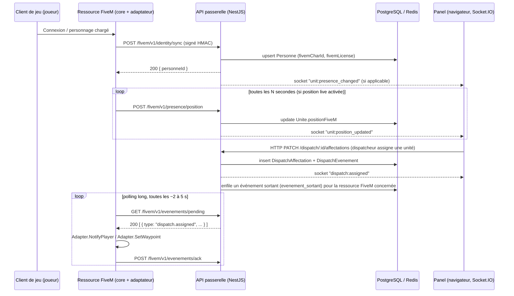

# Spécification de l'API FiveM et des événements temps réel

> Livrable de la section 9 du cahier des charges (`../prompt-panel-fivem-dispatch.md`). Complète [`docs/schema-donnees.md`](schema-donnees.md) (modèles `IntegrationFiveM`, `FiveMEvenementLog`, `Dispatch`, `DispatchEvenement`, `Unite`, `StatutOperationnel`, `Personne`) et le dossier `apps/fivem-resource/` (`core/` + `adapters/esx-legacy`, `adapters/qbcore`, `adapters/qbox`, `adapters/standalone`). Ce document est un cadrage : il ne contient aucune implémentation Lua ou TypeScript réelle, uniquement des contrats, des signatures de fonctions à titre illustratif et des exemples de payloads JSON.

## 0. Principe général

La ressource FiveM (noyau `core/` + un seul adaptateur actif parmi `esx-legacy`, `qbcore`, `qbox`, `standalone`) n'est **jamais** une application autonome. C'est une passerelle technique minimale, sans écran, sans logique métier et sans secret permanent côté client de jeu. Elle communique avec le panel selon deux canaux strictement séparés :

| Canal | Sens | Transport | Consommateur |
| --- | --- | --- | --- |
| API de passerelle FiveM | Ressource FiveM ↔ API métier | HTTPS, requêtes signées serveur-à-serveur (HMAC) | Uniquement le processus serveur FiveM (`core/`), jamais le client de jeu |
| Temps réel panel | Navigateur ↔ API métier | Socket.IO (WebSocket avec repli long-polling), authentifié par session panel | Uniquement les navigateurs des membres du panel |

Ces deux canaux ne se croisent jamais : la ressource FiveM ne se connecte pas à Socket.IO (l'écosystème Lua/FiveM ne garantit pas un client Socket.IO fiable et le serveur de jeu est souvent derrière un NAT sans port entrant exposé), et le navigateur ne parle jamais directement à la ressource FiveM. Toute donnée qui doit aller du panel vers le jeu (affectation, waypoint) transite par l'API métier puis par le canal de passerelle FiveM, décrit en section 3.

Règles non négociables, reprises du cahier des charges (section 3.8, 5, décisions Q12 à Q15) :

- Aucun secret permanent n'est envoyé au client de jeu. La clé de signature (`IntegrationFiveM.cleSignature`) ne réside que dans la configuration serveur de la ressource FiveM (fichier de config généré par le launcher, chargé côté serveur uniquement, jamais répliqué vers un script `client`).
- Toute requête entrante sur la passerelle est vérifiée : signature, fraîcheur, tenant, limite de débit. Un rejet est toujours journalisé dans `FiveMEvenementLog` (`statut = "rejete"`).
- Le noyau est *framework-agnostic* : il n'appelle jamais directement une fonction ESX/QBCore/Qbox. Il passe systématiquement par le contrat d'adaptateur défini en section 1.
- Le panel reste la source de vérité pour tout ce qui est RP-policier (casier, dossiers, warrants, statut opérationnel d'unité). Le framework FiveM reste la source de vérité pour l'identité de base tant que le personnage existe côté serveur de jeu (décision Q12/Q13).
- V1 : pas de synchronisation d'appels ni d'unités complexes depuis FiveM. Les seules données qui remontent sont connexion/déconnexion, identité, position, véhicule courant (best effort) et création d'appel via la commande générique.

## 1. Contrat d'adaptateur

Le noyau (`core/`) ne connaît que ce contrat. Chaque adaptateur (`adapters/esx-legacy`, `adapters/qbcore`, `adapters/qbox`, `adapters/standalone`) doit l'implémenter intégralement pour être chargé. Le noyau détecte l'adaptateur actif via la configuration générée par le launcher (un seul adaptateur actif à la fois par serveur/tenant) et refuse de démarrer si une fonction obligatoire est manquante.

Convention de nommage : `Adapter.<Domaine><Action>`. Toutes les fonctions sont synchrones du point de vue du noyau (l'adaptateur gère lui-même l'asynchrone interne au framework et renvoie une valeur ou `nil`/`false` en cas d'échec, jamais d'exception non gérée).

### 1.1 Identité et joueur

| Fonction | Entrée | Sortie | Description |
| --- | --- | --- | --- |
| `Adapter.GetFrameworkName()` | — | `string` (`"esx_legacy"` \| `"qbcore"` \| `"qbox"` \| `"standalone"`) | Identifiant du framework, envoyé dans chaque payload de synchronisation pour traçabilité. |
| `Adapter.GetPlayerIdentifiers(playerSource)` | `playerSource: number` (id serveur du joueur) | `{ license: string, discordId: string\|nil, steamId: string\|nil }` \| `nil` | Identifiants bruts du compte joueur (licence Cfx = source de vérité compte, décision Q12). `nil` si le joueur n'est plus connecté. |
| `Adapter.GetCharacterId(playerSource)` | `playerSource: number` | `string` \| `nil` | citizenid/charid du personnage RP actuellement chargé. `nil` si aucun personnage n'est encore chargé (écran de sélection multichar en cours). |
| `Adapter.GetIdentitySnapshot(playerSource)` | `playerSource: number` | `IdentitySnapshot \| nil` avec `{ prenom: string, nom: string, dateNaissance: string (ISO 8601, "YYYY-MM-DD"), taille: number (cm, entier), nationalite: string }` | Lecture depuis le système d'identité du framework (ex. `esx_identity`, `qb-identity`/`multicharacter`, équivalent standalone). `nil` si le personnage n'a pas encore rempli sa fiche d'identité — le noyau ne pousse rien dans ce cas. |
| `Adapter.IsCharacterLoaded(playerSource)` | `playerSource: number` | `boolean` | Utilitaire de garde utilisé par le noyau avant tout appel dépendant d'un `charId`. |

### 1.2 Cycle de vie du joueur

| Fonction | Entrée | Sortie | Description |
| --- | --- | --- | --- |
| `Adapter.OnCharacterLoaded(callback)` | `callback: function(playerSource: number, charId: string)` | — (enregistrement d'écouteur) | L'adaptateur doit invoquer `callback` dès qu'un personnage est chargé/sélectionné (connexion initiale ou changement de perso multichar). Déclenche la synchronisation d'identité (section 3.1). |
| `Adapter.OnPlayerDropped(callback)` | `callback: function(playerSource: number, charId: string\|nil, reason: string)` | — | L'adaptateur doit invoquer `callback` à la déconnexion, avant que les données du joueur ne soient purgées côté framework. Déclenche l'événement `presence` de déconnexion. |
| `Adapter.OnCharacterUnloaded(callback)` | `callback: function(playerSource: number, charId: string)` | — | Cas des frameworks avec changement de personnage sans déconnexion complète (ex. retour au menu multichar). Optionnel mais recommandé ; si non supporté par le framework, l'adaptateur peut faire un simple no-op documenté. |

### 1.3 Position, véhicule et statut

| Fonction | Entrée | Sortie | Description |
| --- | --- | --- | --- |
| `Adapter.GetPlayerPosition(playerSource)` | `playerSource: number` | `{ x: number, y: number, z: number, heading: number } \| nil` | Position in-game courante. Utilisée pour la présence (3.1) et pour la commande d'appel générique (3.3). |
| `Adapter.GetCurrentVehicle(playerSource)` | `playerSource: number` | `{ plate: string, model: string, class: string } \| nil` | Véhicule courant si le joueur est au volant/passager d'un véhicule identifiable. Remontée non bloquante (décision Q13) : si l'adaptateur ne peut pas le déterminer simplement, il renvoie `nil` sans erreur. |
| `Adapter.IsPlayerOnDuty(playerSource)` | `playerSource: number` | `boolean` | Optionnel — reflète l'état de service côté framework (ex. `esx:setJob`, `qb-core` duty) si disponible, à titre indicatif seulement. Le statut opérationnel réel reste déclaré côté panel (décision Q13) ; ce champ n'est jamais utilisé pour écrire `Unite.statutOperationnelId`. |

### 1.4 Notification et action côté client de jeu

| Fonction | Entrée | Sortie | Description |
| --- | --- | --- | --- |
| `Adapter.NotifyPlayer(playerSource, message, level)` | `playerSource: number`, `message: string`, `level: "info"\|"warning"\|"success"` | `boolean` (succès de l'affichage) | Affiche une notification texte standard du framework. Utilisé en repli waypoint (section 3.4) et pour les accusés de dispatch. |
| `Adapter.SetWaypoint(playerSource, coords)` | `playerSource: number`, `coords: { x: number, y: number }` | `boolean` (succès) | Tente de poser un waypoint/blip temporaire côté client. Renvoie `false` si le framework/serveur bloque la fonction native associée ; le noyau bascule alors automatiquement sur `Adapter.NotifyPlayer` avec les coordonnées en texte (décision Q14). |
| `Adapter.TriggerGenericCallCommand(playerSource, description)` | `playerSource: number`, `description: string` | `{ accepted: boolean, reason: string\|nil }` | Point d'entrée commun appelé par la commande générique `/911` du noyau (voir 3.3), quel que soit le framework. Permet à un adaptateur de refuser l'appel (ex. joueur menotté/inconscient selon les règles RP du serveur) sans que le noyau connaisse la raison métier du framework. |

### 1.5 Règles d'implémentation

- Toute fonction qui échoue silencieusement doit renvoyer `nil`/`false`, jamais lever une erreur qui interromprait le noyau : le noyau doit rester stable même si un adaptateur est mal configuré.
- Aucune fonction du contrat n'accède directement à la base PostgreSQL ou à l'API du panel : seules les fonctions du noyau (section 3) parlent à la passerelle.
- Un adaptateur ne doit jamais exposer `cleSignature` ni tout secret équivalent à un script `client` : la lecture de configuration se fait exclusivement côté `server`.
- Les adaptateurs `esx-legacy`, `qbcore` et `qbox` s'appuient sur le système d'identité/personnage natif du framework ; l'adaptateur `standalone` doit fournir un système d'identité minimal équivalent (stockage clé-valeur propre) pour renseigner `Adapter.GetIdentitySnapshot`.

## 2. Vue d'ensemble des flux



Ce schéma illustre la raison du choix de conception détaillé en section 3.5 : la ressource FiveM **initie toujours la connexion HTTP**, y compris pour recevoir les événements descendants (affectation, waypoint). Un serveur FiveM communautaire n'a en général aucun port entrant public fiable pour que le panel le rappelle ; le sondage (« polling ») périodique côté ressource, avec accusé de réception, est donc retenu comme mécanisme par défaut pour la v1 plutôt qu'un webhook entrant.

## 3. Endpoints REST de la passerelle

Base commune : `{IntegrationFiveM.endpointUrl}` (URL de l'API métier générée par le launcher lors de la création du tenant, propre à chaque installation SaaS ou dédiée). Tous les chemins ci-dessous sont préfixés par `/fivem/v1`.

Tous les endpoints :
- exigent les en-têtes de signature décrits en section 5 ;
- répondent en `application/json` ;
- renvoient `401 Unauthorized` (signature invalide), `403 Forbidden` (intégration désactivée), `409 Conflict` (nonce déjà utilisé), `422 Unprocessable Entity` (payload invalide), ou `429 Too Many Requests` (limite de débit) selon le cas, avec un corps `{ error: string, code: string }` homogène ;
- sont journalisés dans `FiveMEvenementLog` (type, `payloadHash`, statut).

### 3.1 Synchronisation d'identité

`POST /fivem/v1/identity/sync`

But : pousser l'identité RP du joueur vers la fiche `Personne`, à la création du personnage et à chaque connexion/sélection de personnage (déclenché par `Adapter.OnCharacterLoaded`).

```json
{
  "framework": "qbcore",
  "charId": "ABC12345",
  "license": "license:1a2b3c4d5e6f...",
  "discordId": "112233445566778899",
  "identite": {
    "prenom": "John",
    "nom": "Doe",
    "dateNaissance": "1990-04-12",
    "taille": 182,
    "nationalite": "Américaine"
  },
  "serveurTimestamp": "2026-08-11T20:14:03.000Z"
}
```

Réponse `200` :

```json
{
  "personneId": "b7e2c1a0-...-uuid",
  "statut": "cree",
  "matchedOn": "fivemCharId"
}
```

Règles :
- Clé de correspondance : couple `(tenantId, charId)` — jamais `license` seule (un joueur peut avoir plusieurs personnages).
- Si `identite` est absente (personnage pas encore passé par l'écran d'identité), la requête est acceptée mais ne crée qu'un enregistrement technique minimal (`charId`/`license` liés), sans forcer de fiche `Personne` incomplète ; un second appel suit dès que l'identité est disponible.
- Le panel ne réécrit jamais `nom`/`prenom`/`dateNaissance`/`taille`/`nationalite` depuis son interface tant que le personnage existe côté FiveM (le framework reste source de vérité, décision Q12) — ces champs restent en lecture seule côté panel dans ce cas, modifiables uniquement si l'intégration FiveM est désactivée pour ce tenant ou si la fiche est explicitement détachée.

### 3.2 Présence : connexion, déconnexion, position

`POST /fivem/v1/presence/session`

But : signaler une connexion ou une déconnexion (`Adapter.OnCharacterLoaded` / `Adapter.OnPlayerDropped`).

```json
{
  "framework": "esx_legacy",
  "charId": "ABC12345",
  "license": "license:1a2b3c4d5e6f...",
  "evenement": "connexion",
  "position": { "x": 441.8, "y": -981.2, "z": 30.7, "heading": 88.4 },
  "vehicule": { "plate": "12ABC345", "model": "police3", "class": "emergency" },
  "serveurTimestamp": "2026-08-11T20:14:03.000Z"
}
```

`evenement` vaut `"connexion"` ou `"deconnexion"`. `position` et `vehicule` sont facultatifs sur `"deconnexion"`.

`POST /fivem/v1/presence/position`

But : mise à jour périodique de position et véhicule courant, uniquement si l'organisme du membre a activé le partage de position live (décision Q19) ; sinon la ressource n'appelle pas cet endpoint et le statut retombe sur une position saisie manuellement côté panel.

```json
{
  "charId": "ABC12345",
  "position": { "x": 441.8, "y": -981.2, "z": 30.7, "heading": 88.4 },
  "vehicule": { "plate": "12ABC345", "model": "police3", "class": "emergency" },
  "serveurTimestamp": "2026-08-11T20:14:08.000Z"
}
```

Réponse `202 Accepted` (traitement asynchrone, pas de corps significatif au-delà d'un accusé). Le noyau doit envoyer cet appel à intervalle raisonnable (recommandé : 5 à 10 s, jamais moins de 3 s) : la limite de débit (section 5.3) rejettera toute fréquence excessive.

Le gateway résout `charId` → `Affectation` active → `Unite` (si le membre fait partie d'un équipage engagé) et met à jour `Unite.positionFiveM`, puis diffuse `unit:position_updated` (section 4) aux salles concernées. Si `charId` ne correspond à aucune affectation active, la position est ignorée pour la carte (elle n'alimente que la présence technique).

### 3.3 Création d'appel via la commande générique (`/911`)

`POST /fivem/v1/dispatch/appel`

But : point d'entrée unique pour tout appel déclenché en jeu, via `Adapter.TriggerGenericCallCommand`, complémentaire à la saisie manuelle côté panel (décision Q15).

```json
{
  "framework": "qbox",
  "charId": "ABC12345",
  "description": "Vol à main armée signalé au 24 Alta Street, suspect armé encore présent",
  "position": { "x": -50.1, "y": -1120.4, "z": 26.4 },
  "serveurTimestamp": "2026-08-11T20:16:41.000Z"
}
```

Réponse `201` :

```json
{
  "dispatchId": "9c4e7b10-...-uuid",
  "numero": "DSP-2026-004821",
  "statut": "NOUVEAU"
}
```

Règles :
- Le gateway crée un `Dispatch` avec `categorie` par défaut « appel citoyen », `priorite` par défaut « normale » (ajustables ensuite par le dispatcheur côté panel), `appelantRp` renseigné à partir de la fiche `Personne` liée à `charId` si elle existe.
- `coordonneesFiveM` est renseigné depuis `position` ; `coordonneesSvg` est calculé côté API via la fonction de conversion documentée dans le brief carte (Q20), pas côté FiveM.
- Cette création alimente aussi `JournalAudit` (acteur = compte technique de l'intégration FiveM, pas un utilisateur panel) en plus de `FiveMEvenementLog`, car elle a un effet métier direct.
- En v1, aucun autre type d'objet (unité, équipage) n'est créé automatiquement depuis cet appel (décision Q13) : le dispatcheur affecte manuellement les unités côté panel.

### 3.4 Réception des affectations et envoi de waypoint (descendant)

Ces deux besoins partagent le même mécanisme de sondage décrit en section 3.5 : ce ne sont pas des endpoints que le panel appelle sur la ressource FiveM, mais des événements que la ressource récupère elle-même.

Exemple d'événement `dispatch.assigned` récupéré via `GET /fivem/v1/evenements/pending` :

```json
{
  "eventId": "6f1a9e20-...-uuid",
  "type": "dispatch.assigned",
  "charId": "ABC12345",
  "payload": {
    "dispatchId": "9c4e7b10-...-uuid",
    "numero": "DSP-2026-004821",
    "priorite": "urgente",
    "categorie": "appel_citoyen",
    "resume": "Vol à main armée signalé au 24 Alta Street",
    "consignes": "Approche discrète, suspect potentiellement armé"
  },
  "emitAt": "2026-08-11T20:17:02.000Z"
}
```

Exemple d'événement `dispatch.waypoint` :

```json
{
  "eventId": "0a2f7c31-...-uuid",
  "type": "dispatch.waypoint",
  "charId": "ABC12345",
  "payload": {
    "dispatchId": "9c4e7b10-...-uuid",
    "coordonneesFiveM": { "x": -50.1, "y": -1120.4, "z": 26.4 }
  },
  "emitAt": "2026-08-11T20:17:02.500Z"
}
```

Traitement côté noyau :
1. Le noyau reçoit l'événement, résout `charId` → `playerSource` local (table de correspondance maintenue en mémoire par la ressource).
2. Pour `dispatch.assigned` : `Adapter.NotifyPlayer(playerSource, resume, "info")`.
3. Pour `dispatch.waypoint` : `Adapter.SetWaypoint(playerSource, coords)` ; si `false`, repli automatique sur `Adapter.NotifyPlayer` avec les coordonnées en texte (décision Q14).
4. Le noyau appelle ensuite `POST /fivem/v1/evenements/ack` avec `{ "eventId": "..." }` pour chaque événement traité, y compris en cas d'échec de livraison en jeu (le joueur déconnecté par exemple) — l'échec de livraison en jeu est un aléa RP normal, pas une erreur technique à retenter indéfiniment.

`GET /fivem/v1/evenements/pending`

Paramètres de requête : `wait` (secondes d'attente en long-polling, défaut 20, max 25), `curseur` optionnel (dernier `eventId` traité, pour idempotence en cas de retry réseau).

Réponse `200` : tableau d'événements (vide si rien à livrer avant expiration de `wait`).

`POST /fivem/v1/evenements/ack`

```json
{ "eventId": "6f1a9e20-...-uuid" }
```

Réponse `204`. Un événement non acquitté après un délai de rétention (recommandé : 2 minutes) est considéré expiré et n'est plus redistribué — le panel journalise l'expiration mais ne bloque jamais le flux dispatch pour un joueur déconnecté.

### 3.5 Pourquoi le sondage plutôt qu'un webhook entrant

Le noyau **initie systématiquement** les appels HTTP vers la passerelle, dans les deux sens fonctionnels (montant et descendant). Raison retenue : un serveur FiveM communautaire est très souvent hébergé derrière un NAT/pare-feu sans port entrant public fiable pour le panel, et la stack Lua ne dispose pas d'un client Socket.IO officiellement supporté. Le sondage périodique (`GET /fivem/v1/evenements/pending` en long-polling) offre une compatibilité universelle avec les quatre adaptateurs sans configuration réseau supplémentaire côté client FiveM. Une future évolution optionnelle (webhook entrant configurable si le serveur FiveM expose un port public) pourra être ajoutée en Phase 4+ sans changer le contrat d'adaptateur.

### 3.6 Récapitulatif des endpoints

| Méthode | Chemin | Sens | But |
| --- | --- | --- | --- |
| `POST` | `/fivem/v1/identity/sync` | FiveM → Panel | Synchroniser l'identité RP à la création/connexion du personnage |
| `POST` | `/fivem/v1/presence/session` | FiveM → Panel | Signaler connexion/déconnexion |
| `POST` | `/fivem/v1/presence/position` | FiveM → Panel | Pousser position + véhicule courant (si activé) |
| `POST` | `/fivem/v1/dispatch/appel` | FiveM → Panel | Créer un appel via `/911` générique |
| `GET` | `/fivem/v1/evenements/pending` | FiveM ⇄ Panel (sondage) | Récupérer les événements descendants en attente (affectation, waypoint) |
| `POST` | `/fivem/v1/evenements/ack` | FiveM → Panel | Accuser réception d'un événement descendant |

## 4. Événements temps réel Socket.IO (panel)

Namespace dédié : `/realtime`. Authentification à la connexion (handshake) par le même jeton de session que l'API HTTP du panel (cookie de session ou JWT court porté en `auth.token`) — jamais par un `tenantId`/`organismeId` fourni librement par le client. Le serveur résout systématiquement le tenant et les organismes autorisés depuis la session avant toute adhésion à une salle.

### 4.1 Structure des salles

| Salle | Convention de nom | Adhésion | Usage |
| --- | --- | --- | --- |
| Tenant | `tenant:{tenantId}` | Automatique à la connexion, dérivée de la session | Notifications transverses au tenant (BOLO diffusés à tout le tenant, alertes globales) |
| Organisme | `tenant:{tenantId}:organisme:{organismeId}` | Automatique pour chaque `Affectation` active de l'utilisateur, ou sur bascule de l'organisme « actif » en session (décision Q7) | Fil d'activité dispatch, statuts d'unités, BOLO restreints à des divisions de cet organisme |
| Division (optionnel, ciblage fin) | `tenant:{tenantId}:organisme:{organismeId}:division:{divisionId}` | Sur adhésion explicite si le membre est rattaché à la division | Diffusion restreinte type BOLO limité à certaines divisions (décision Q23) |
| Dispatch (détail) | `tenant:{tenantId}:dispatch:{dispatchId}` | Sur ouverture de la fiche dispatch côté panel, quittée à la fermeture | Événements fins d'un dispatch précis (commentaire ajouté, arrivée sur place) sans surcharger la salle organisme |
| Utilisateur | `user:{utilisateurId}` | Automatique à la connexion | Notifications personnelles (`Notification` non lues, accusé BOLO) |

Le serveur vérifie à chaque tentative d'adhésion que l'utilisateur dispose bien d'une `Affectation` active sur l'organisme/la division ciblée et de la permission de lecture correspondante ; un dispatch marqué `confidentiel = true` n'est jamais diffusé dans une salle où un membre non autorisé est présent (filtrage à l'émission, pas seulement à l'affichage — cf. section 3.7 du cahier des charges).

### 4.2 Catalogue des événements

Tous les événements sont émis serveur → client (le client n'émet jamais d'événement métier directement ; toute action passe par l'API REST, qui déclenche ensuite la diffusion Socket.IO).

| Événement | Salle | Payload (exemple) | Description |
| --- | --- | --- | --- |
| `dispatch:created` | organisme | voir ci-dessous | Nouveau dispatch créé (manuel, `/911`, import futur) |
| `dispatch:assigned` | organisme + dispatch | voir ci-dessous | Une unité est affectée/désaffectée |
| `dispatch:status_changed` | organisme + dispatch | `{ dispatchId, ancienStatut, nouveauStatut, parId, at }` | Changement de statut du dispatch (`DispatchStatut`) |
| `dispatch:evenement_added` | dispatch | `{ dispatchId, evenement: { id, type, texte, auteurId, createdAt } }` | Nouvelle entrée dans le fil d'activité (`DispatchEvenement`) |
| `dispatch:closed` | organisme + dispatch | `{ dispatchId, statut: "CLOTURE" \| "ANNULE", clotureParId, at }` | Fermeture ou annulation |
| `unit:status_changed` | organisme | `{ uniteId, indicatif, ancienStatutId, nouveauStatutId, declarePar: "panel", at }` | Changement de statut opérationnel d'une unité (toujours déclaré côté panel, décision Q13) |
| `unit:position_updated` | organisme | `{ uniteId, positionFiveM: { x, y, z, heading }, positionSvg, at }` | Position live d'une unité en service, si le partage est activé pour l'organisme |
| `bolo:published` | tenant ou division ciblée | voir ci-dessous | Nouveau BOLO diffusé |
| `bolo:expired` | tenant ou division ciblée | `{ boloId, at }` | Expiration automatique (72h par défaut, décision Q23) |
| `notification:new` | utilisateur | `{ notificationId, type, cibleType, cibleId, createdAt }` | Notification personnelle (relié à `Notification`) |
| `presence:sync` | organisme | `{ charId, personneId, uniteId: string\|nil, evenement: "connexion"\|"deconnexion", at }` | Reflet côté panel d'une connexion/déconnexion FiveM pertinente pour une unité active |

Exemple `dispatch:created` :

```json
{
  "event": "dispatch:created",
  "room": "tenant:9f1e.../organisme:2b7a...",
  "payload": {
    "dispatchId": "9c4e7b10-...-uuid",
    "numero": "DSP-2026-004821",
    "priorite": "urgente",
    "categorie": "appel_citoyen",
    "statut": "NOUVEAU",
    "lieu": "24 Alta Street",
    "confidentiel": false,
    "createdAt": "2026-08-11T20:16:42.100Z"
  }
}
```

Exemple `dispatch:assigned` :

```json
{
  "event": "dispatch:assigned",
  "room": "tenant:9f1e.../dispatch:9c4e7b10-...",
  "payload": {
    "dispatchId": "9c4e7b10-...-uuid",
    "uniteId": "3d8a1c40-...-uuid",
    "indicatif": "1L-24",
    "assignedById": "utilisateur-uuid",
    "assignedAt": "2026-08-11T20:17:01.900Z"
  }
}
```

Exemple `bolo:published` :

```json
{
  "event": "bolo:published",
  "room": "tenant:9f1e...",
  "payload": {
    "boloId": "77af...-uuid",
    "priorite": "haute",
    "signalement": "Véhicule gris, plaque partielle 12AB..., fuite après braquage",
    "vehiculeId": "veh-uuid-ou-null",
    "dateExpiration": "2026-08-14T20:20:00.000Z",
    "destinataires": ["tout_le_tenant"]
  }
}
```

### 4.3 Reprise propre après déconnexion/reconnexion

Le dispatch temps réel doit rester cohérent même après une coupure réseau côté navigateur (décision explicite section 3.7). Stratégie retenue :

1. **Reconnexion transport** : le client Socket.IO utilise la reconnexion automatique avec back-off exponentiel (paramètres standard de la librairie). Optionnellement, la fonctionnalité *connection state recovery* de Socket.IO (rejoue les événements manqués si la coupure est courte, quelques dizaines de secondes) peut être activée côté serveur comme optimisation, mais elle **n'est jamais la seule garantie de cohérence** — elle ne couvre pas les coupures longues ni un redémarrage de serveur applicatif.
2. **Resynchronisation applicative obligatoire** : à chaque `connect` (initial ou reconnexion), le client :
   - ré-adhère aux salles pertinentes selon sa session courante (tenant, organisme actif, dispatch(s) ouverts) ;
   - appelle immédiatement l'API REST de synchronisation delta, par exemple `GET /api/v1/dispatch?organismeId=...&updatedSince=<dernier timestamp connu>` et `GET /api/v1/unites?organismeId=...&updatedSince=...`, pour récupérer tout ce qui a changé pendant la coupure (créations, changements de statut, clôtures), indépendamment des événements Socket.IO manqués ;
   - remplace son état local par le résultat de cette resynchronisation plutôt que de tenter de rejouer un historique d'événements un par un — plus simple et robuste qu'un flux d'événements garantis exactement-une-fois.
3. **Horodatage de référence** : le client conserve le plus récent `updatedAt`/`createdAt` vu toutes ressources confondues par organisme ; c'est ce curseur qui alimente `updatedSince`, pas un identifiant d'événement Socket.IO (les événements socket sont une notification de fraîcheur, pas la source de vérité).
4. **Indicateur d'état** : le panel affiche un indicateur visuel (ex. bandeau « reconnexion en cours ») dès que le transport Socket.IO est déconnecté, et le retire seulement après la resynchronisation REST réussie — jamais seulement après le `connect` du transport, pour éviter d'afficher des données obsolètes comme à jour.

## 5. Sécurité

### 5.1 Signature des appels serveur-à-serveur (FiveM → passerelle)

Chaque requête HTTP de la ressource FiveM vers la passerelle porte les en-têtes suivants :

| En-tête | Contenu |
| --- | --- |
| `X-Panel-Integration-Id` | `IntegrationFiveM.id`, permet de retrouver le tenant et la clé sans faire confiance à un `tenantId` fourni en clair |
| `X-Panel-Timestamp` | Horodatage Unix en millisecondes au moment de l'envoi |
| `X-Panel-Nonce` | UUID v4 généré pour cette requête uniquement |
| `X-Panel-Signature` | HMAC-SHA256 hexadécimal, voir formule ci-dessous |

Chaîne canonique signée :

```
methode + "\n" + chemin + "\n" + timestamp + "\n" + nonce + "\n" + sha256(corpsBrut)
```

```
signature = HMAC_SHA256(cleSignature, chaineCanonique)
```

Le serveur recalcule la même chaîne à partir de la requête reçue et compare en temps constant. Toute divergence renvoie `401` et journalise `FiveMEvenementLog(statut = "erreur", type = "signature_invalide")`.

### 5.2 Anti-rejeu

- `X-Panel-Timestamp` doit être dans une fenêtre de ±300 secondes par rapport à l'heure serveur ; hors fenêtre → `401`, journalisé `statut = "rejete"`, `type = "timestamp_hors_fenetre"`.
- `X-Panel-Nonce` est enregistré dans Redis avec une expiration de 10 minutes dès acceptation ; toute réutilisation du même nonce dans cette fenêtre → `409 Conflict`, journalisé `type = "nonce_reutilise"`.
- Ces deux contrôles combinés empêchent le rejeu d'une requête interceptée, même si le transport TLS était compromis a posteriori (défense en profondeur).

### 5.3 Limitation de débit

Compteurs Redis en fenêtre glissante, par `(tenantId, integrationId, catégorie d'endpoint)`, avec réponse `429` + en-tête `Retry-After` en cas de dépassement :

| Catégorie | Endpoints | Limite par défaut |
| --- | --- | --- |
| Identité | `/identity/sync` | 30 req/min |
| Présence session | `/presence/session` | 60 req/min |
| Présence position | `/presence/position` | 1 req / 3 s par `charId`, 120 req/min agrégé par intégration |
| Dispatch (`/911`) | `/dispatch/appel` | 20 req/min agrégé (protection contre le spam d'appels) |
| Sondage événements | `/evenements/pending`, `/evenements/ack` | 30 req/min (cohérent avec un intervalle de sondage ≥ 2 s) |

Ces limites sont des valeurs par défaut modifiables par intégration (`IntegrationFiveM`) depuis l'administration super-admin, sans nécessiter de déploiement.

### 5.4 Rotation des secrets et désactivation

- `IntegrationFiveM.cleSignature` peut être régénérée depuis le launcher ; pour éviter toute coupure, deux lignes `IntegrationFiveM` (ancienne et nouvelle clé) peuvent coexister brièvement pour un même tenant le temps que la configuration serveur FiveM soit redéployée, puis l'ancienne est désactivée (`activee = false`).
- Une intégration désactivée (`activee = false`) répond `403` à tout appel, sans exposer si l'ID d'intégration existe réellement (message générique).
- Aucun secret n'est jamais renvoyé en clair par une réponse API après sa création initiale ; seule une empreinte tronquée est affichée dans l'administration pour vérification visuelle.

### 5.5 Journalisation

- Chaque appel de passerelle (succès, erreur, rejet) crée une ligne `FiveMEvenementLog` : `tenantId`, `type` (ex. `identity_sync`, `presence_position`, `dispatch_appel`, `evenement_ack`), `payloadHash` (empreinte, jamais le contenu brut, pour éviter de dupliquer des données personnelles RP dans un journal technique), `statut` (`ok` | `erreur` | `rejete`).
- Les appels ayant un effet métier direct (ex. `/dispatch/appel` qui crée un `Dispatch`) déclenchent en plus une entrée `JournalAudit` classique, avec un acteur technique dédié (compte système « Intégration FiveM — {framework} ») distinct des utilisateurs panel, pour rester traçable dans l'historique métier standard.
- Les rejets répétés (signature invalide, nonce réutilisé) au-delà d'un seuil configurable déclenchent une alerte à l'administration du tenant (canal à définir en Phase 4, hors scope de ce document) — le principe de journalisation systématique, lui, est requis dès la Phase 1.

### 5.6 Ce qui monte, ce qui descend

| Direction | Nature des données | Mécanisme |
| --- | --- | --- |
| FiveM → Panel (montant) | Identité RP à la connexion/création de personnage ; connexion/déconnexion ; position + véhicule courant (si activé) ; création d'appel via `/911` | Appels HTTP signés initiés par la ressource FiveM (section 3.1 à 3.3) |
| Panel → FiveM (descendant) | Affectation d'une unité à un dispatch ; envoi de waypoint | Événements mis en file côté API, récupérés par sondage HTTP signé initié par la ressource FiveM (section 3.4/3.5) — jamais un appel entrant du panel vers le serveur de jeu |
| Panel → Navigateurs (temps réel) | Tout l'état dispatch/unités/BOLO/notifications | Socket.IO, salles par tenant/organisme/dispatch/utilisateur (section 4) |
| Navigateur → Panel | Toute action métier (créer, affecter, changer un statut) | API REST classique du panel, jamais directement via Socket.IO ni jamais directement vers la ressource FiveM |

Ce tableau formalise la règle d'architecture du cahier des charges (section 5) : la ressource FiveM n'appelle qu'une API de passerelle authentifiée, le navigateur ne dialogue jamais avec la base ni avec la ressource FiveM, et aucune des deux extrémités ne détient de secret permanent au-delà de la session utilisateur (courte, renouvelable) côté navigateur et de `cleSignature` côté serveur FiveM uniquement.

## 6. Points ouverts pour les phases suivantes

- **Webhook entrant optionnel** (Phase 4+) pour les serveurs FiveM qui exposent un port public, en complément du sondage, afin de réduire la latence de livraison des affectations/waypoints en dessous de l'intervalle de sondage.
- **mTLS ou pinning de certificat** pour les installations dédiées à forte exigence de sécurité, en complément de la signature HMAC applicative.
- **Téléphone RP tiers** : un futur adaptateur optionnel pourra appeler `/fivem/v1/dispatch/appel` depuis un contexte téléphone plutôt que la commande `/911` générique, sans changer le contrat ni le noyau (décision Q15).
- **Canaux radio/vocaux** : hors scope de cette spécification (décision Q18), le vocal continue de passer par les outils externes du serveur.
