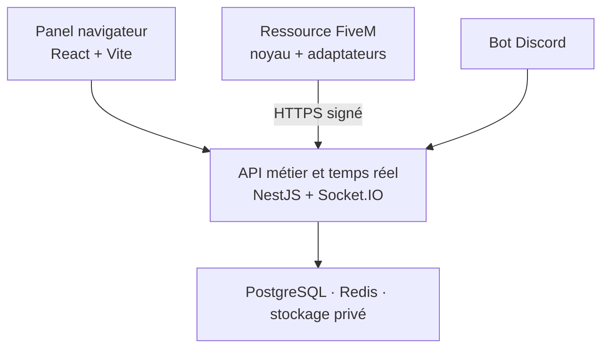

# Cahier des charges et prompt maître — Panel de dispatch FiveM

> Version 0.1 · Projet B2B multi-clients · Langue principale : français  
> Règle de départ : aucune fonctionnalité de production ne doit être développée avant d'avoir traité les questions de cadrage de ce document.

## Prompt prêt à donner à un agent de développement

Tu es l'architecte logiciel et lead développeur d'un panel de police FiveM accessible depuis un navigateur. Le produit sera vendu ou installé chez plusieurs clients : chaque client doit pouvoir administrer ses propres organismes, par exemple LSPD, SAHP, BCSO, USMS ou une organisation entièrement personnalisée.

Construis un produit fiable, modulaire et maintenable, pensé comme un CAD/MDT/dispatch de jeu de rôle FiveM. Les données, appellations, procédures et cartes concernent le RP ; n'invente jamais de connexion à des fichiers ou bases de données réelles.

Avant toute ligne de code métier :

1. Relis intégralement ce document.
2. Réponds aux questions de cadrage encore ouvertes, ou demande les précisions manquantes.
3. Propose une architecture unique et argumentée, un modèle de données initial, les limites du MVP et un découpage par phases.
4. N'écris du code qu'après validation explicite des décisions structurantes : mode d'hébergement, isolation des clients, intégrations FiveM, gestion des droits et rôle réel du launcher.

Principes non négociables :

- Le produit est **multi-tenant** : aucune donnée, permission, notification ou recherche d'un client ne doit pouvoir être lue ou modifiée par un autre client.
- Un client peut créer plusieurs organismes ; un organisme peut contenir des divisions, grades, spécialités et règles propres.
- Les permissions sont évaluées côté serveur, jamais seulement dans l'interface.
- Toute action sensible doit être auditée : création, modification, suppression logique, consultation de dossiers confidentiels, export, attribution et changement de droits.
- Les intégrations FiveM et Discord doivent utiliser des accès limités, authentifiés et journalisés. Aucun secret ne doit être envoyé au navigateur.
- La carte GTA V doit être une création ou un asset dont les droits de revente sont vérifiés. Prévoir une carte SVG stylisée et paramétrable, pas la copie non vérifiée d'un asset tiers.
- Le produit doit être utilisable sur PC en priorité, réactif en temps réel et compatible avec les navigateurs modernes.

---

## 0. Décisions structurantes validées (11/08/2026)

Ces décisions lèvent le blocage posé en introduction pour les quatre points structurants cités en section « Principes non négociables ». Les autres questions de la section 8 restent à traiter au fil des phases.

| Décision | Choix retenu | Implication |
| --- | --- | --- |
| Hébergement | SaaS centralisé **et** installation dédiée, dès la v1 | Le socle doit être déployable en mode multi-tenant ou en instance unique avec le même code, seule la configuration de déploiement change. Aucune logique métier ne doit supposer un seul mode. Les deux chemins de déploiement doivent être validés avant la sortie du MVP, ce qui alourdit la Phase 1. |
| Portée client | Un client = un serveur FiveM au lancement | Le modèle tenant reste simple : un tenant = un serveur. La licence est rattachée au tenant (et non au serveur en dur) afin de ne pas bloquer une évolution future vers plusieurs serveurs par client. |
| Frameworks FiveM | ESX Legacy, QBCore, Qbox et standalone tous compatibles dès la v1 | Le noyau de la ressource FiveM doit être framework-agnostic dès la Phase 1 (voir 3.8), avec une interface d'adaptateur unique et testée. Les quatre adaptateurs concrets sont développés en parallèle avant la sortie publique, et non plus étalés jusqu'en Phase 4 — voir le calendrier mis à jour en section 7. |
| Launcher | Assistant web d'installation uniquement, pas d'application bureau | Le launcher est un module du panel web (écran admin) qui crée le tenant, configure les clés/adaptateurs, teste la connexion FiveM/Discord et génère le fichier de configuration à déposer côté serveur. La Phase 5 (app bureau Tauri) reste hors scope tant qu'un besoin concret n'est pas démontré. |

> **Rappel important** : le produit entier — dispatch, rapports, registres, casier judiciaire, carte, administration — est une **application web** consultée depuis un navigateur. Ce n'est jamais un script ou une ressource FiveM en lui-même. La ressource FiveM (Lua) n'est qu'une passerelle technique minimale entre le serveur de jeu et l'API du panel : aucune logique métier, aucun écran, aucun secret permanent ne doit y résider. Voir section 3.8.

### 0.1 Décisions complémentaires validées (11/08/2026)

Réponses aux questions restantes de la section 8, validées telles que recommandées. Chaque question de la section 8 renvoie ici par son numéro.

**Produit et clients**

- **Q3 — Modèle de licence** : mensuelle et/ou à vie, avec un essai gratuit — plusieurs formules coexistent dès la v1 plutôt qu'un modèle unique imposé.
- **Q4 — Limite d'organismes par client** : limitée selon l'offre de licence (le nombre d'organismes qu'un client peut créer fait partie des paliers commerciaux).
- **Q5 — Super-admin global** : oui, avec un accès large (licences, aide au dépannage client) mais entièrement journalisé/audité — jamais un accès silencieux.

**Identité et droits**

- **Q6 — Connexion des membres** : Discord OAuth.
- **Q7 — Multi-appartenance** : un membre peut appartenir à plusieurs organismes et divisions en même temps, avec un organisme « actif » sélectionné en session pour contextualiser l'affichage et les permissions.
- **Q8 — Grade** : purement visuel/hiérarchique. Il ne porte jamais de permission par défaut ; seul le RBAC (rôles/permissions) détermine les droits réels.
- **Q9 — Approbation obligatoire** : warrant, clôture définitive d'un dossier d'enquête, export de données et modification/annulation d'une entrée de casier judiciaire exigent une approbation par défaut. BOLO et rapports standards restent publiables sans approbation obligatoire, mais le workflow reste configurable par organisme (3.3).
- **Q10 — Double authentification** : obligatoire pour tout rôle porteur d'une permission sensible (administration, approbation de warrant, accès casier judiciaire, export, gestion des droits) — pas seulement les administrateurs.

**Compatibilité FiveM**

- **Q12 — Identifiants source de vérité** : la licence FiveM (Cfx) identifie le compte joueur ; le citizenid/charid du framework identifie chaque personnage RP (un joueur peut avoir plusieurs personnages). C'est le couple (tenant + charid) qui fait autorité pour la fiche personne. Le Discord ID ne sert qu'à l'authentification staff sur le panel. Le matricule RP est un attribut métier assigné par l'organisme, pas un identifiant technique.
- **Q13 — Données v1 FiveM ↔ panel** : connexion/déconnexion du joueur, identité liée, position, et statut opérationnel de l'unité (déclaré côté panel). Le véhicule courant est remonté si l'adaptateur le permet simplement, sans être bloquant. Pas de synchronisation d'appels ni d'unités complexes depuis FiveM en v1.
- **Q14 — Waypoint** : oui — le panel envoie un événement serveur signé, le noyau Lua déclenche un waypoint/blip temporaire côté client, avec repli sur une notification texte avec coordonnées si le waypoint est bloqué côté serveur.
- **Q15 — Origine des appels** : saisie manuelle côté panel par le dispatch, complétée par une commande générique du noyau FiveM (type `/911`) déclenchable par chaque adaptateur. Pas de dépendance à une ressource téléphone tierce spécifique en v1 ; une intégration à un téléphone RP précis pourra venir plus tard comme adaptateur optionnel.

**Dispatch et carte**

- **Q16 — Statuts opérationnels au lancement** : disponible, en patrouille, en route, sur intervention, indisponible, pause, hors service — liste configurable par organisme (libellé, couleur, icône).
- **Q17 — Priorités et catégories** : socle par défaut (priorités faible/normale/urgente/critique ; catégories appel citoyen/trafic/alarme/BOLO actif/assistance unité/administratif), entièrement personnalisable par organisme.
- **Q18 — Radio, canaux, patrouilles** : les patrouilles/unités multi-équipiers sont gérées dès la v1 (une unité = un identifiant, un statut, plusieurs membres). La radio vocale et les canaux audio restent hors scope v1 ; le vocal continue de passer par les outils existants du serveur (Discord/TeamSpeak). Seul un fil d'activité textuel par organisme est prévu (déjà couvert par 3.7).
- **Q19 — Position live sur la carte** : affichage par défaut limité aux unités en service (statut ≠ hors service) et aux marqueurs saisis, jamais à tous les membres du tenant en permanence. Le partage de position live du joueur FiveM est optionnel et activable par organisme, avec repli sur une position saisie manuellement si désactivé.
- **Q20 — Carte SVG** : aucun asset exploitable avec droit de revente n'existe actuellement → un brief de création originale est nécessaire. Le brief couvre : style « plan tactique » sobre cohérent avec l'UI sombre (pas de rendu satellite réaliste) ; découpage par juridictions/quartiers RP du monde GTA V avec frontières éditables par organisme et calques activables (routes, bâtiments clés, points d'intérêt, juridictions) ; niveau de détail suffisant pour situer une intervention sans reproduire l'intégralité du fond de carte du jeu, avec système de coordonnées SVG documenté et fonction de conversion vers les coordonnées in-game FiveM.

**Précisions patrouilles / opérations (11/08/2026)**, actées pendant l'implémentation de l'écran dispatch :

- **Vue principale du dispatch = les patrouilles**, pas la liste d'interventions. L'écran par défaut montre qui est en service, avec qui (équipage), dans quel véhicule et avec quel armement ; les interventions et les opérations restent accessibles en onglets secondaires mais liés (une intervention ou une opération s'appuie sur des patrouilles existantes, elle n'en recrée pas).
- **Armement déclaré au niveau de la patrouille** (`Unite`), pas par agent individuel. Le registre des armes de service (`ArmeService`, section 3.4) reste la source de vérité pour l'inventaire et la traçabilité, mais l'écran dispatch affiche un chargement déclaré par patrouille, plus simple à saisir en RP.
- **Double déclaration** : un agent peut prendre son propre service (choisir son coéquipier, son véhicule, déclarer son armement) via un flux en libre-service ; un dispatch/superviseur peut à tout moment assigner ou corriger n'importe quelle patrouille depuis son propre écran. Les deux écrivent dans la même entité `Unite`, avec traçabilité de l'auteur du dernier changement.
- **Opération ≠ Intervention.** Une **intervention** reste réactive : elle naît d'un appel/événement (911, alarme, BOLO croisé), dure le temps de traiter la situation, et correspond à l'écran déjà spécifié en 3.7. Une **opération** est un objet distinct, planifiée à l'avance (contrôle routier ciblé, descente, surveillance), avec un objectif, une ou plusieurs patrouilles assignées, une fenêtre de temps prévue et un statut propre (planifiée, en cours, terminée, annulée) — elle n'est pas rattachée à un appel précis. Une intervention peut naître de façon impromptue « en marge » d'une opération en cours, mais reste un objet séparé avec son propre cycle de vie.

**Dossiers, registres et casier judiciaire**

- **Q21 — Catégories de rapport v1** : arrestation, incident de service, usage de la force, accident/collision, contrôle routier/personne, perquisition, mise en fourrière, rapport d'enquête.
- **Q22 — Cycle de vie du rapport** : création/soumission par l'auteur ; correction par l'auteur si renvoyé « à corriger » ; approbation, archivage et réouverture réservés à un rôle superviseur/gradé désigné par organisme (ou un rôle « greffe/administration » dédié).
- **Q23 — Expiration et diffusion warrants/BOLO** : warrant avec date d'expiration configurable et visa d'un rôle supérieur obligatoire à l'émission. BOLO avec expiration courte par défaut (72h, reconductible), diffusion à tout le tenant par défaut, restreignable à certaines divisions si le client l'active.
- **Q25 — Pièces jointes** : images (jpg/png/webp) et documents PDF uniquement, 10 Mo par fichier, 10 fichiers max par rapport, stockage privé avec URL signées temporaires et vérification du type MIME réel.
- **Q26 — Export/impression** : oui, gabarit d'impression officiel configurable par organisme (logo, en-tête, pied de page), export PDF réservé à la permission « exporter ».
- **Q24 — Champs obligatoires armes et véhicules** : armes civiles et de service — numéro de série, modèle, statut (en circulation, saisie, détruite) ; véhicules civils et de service — plaque, modèle, couleur, statut. Le propriétaire/assignataire (personne, membre ou organisme) est obligatoire mais peut rester « inconnu » tant que l'enquête n'a pas abouti. Le reste (couleur détaillée, options, historique d'entretien...) reste en champ personnalisé configurable par client, conformément à 3.4.
- **Q33 — Visibilité du casier judiciaire** : réservée aux rôles habilités (permission dédiée « consulter le casier ») — enquêteurs, direction et greffe par défaut, autres rôles sur attribution explicite.
- **Q34 — Création d'une entrée de casier** : génération automatique depuis un rapport/jugement RP validé (workflow d'approbation) ; création manuelle possible uniquement pour les rôles porteurs de la permission « gérer le casier judiciaire ».
- **Q35 — Amnistie/grâce/prescription** : mécanisme obligatoire — statut modifiable (purgée, graciée, amnistiée) avec motif et auteur conservés, jamais de suppression physique, actionnable uniquement via la permission « gérer le casier judiciaire ».
- **Q36 — Consultation par le civil** : pas d'accès civil en v1 ; option pour une consultation publique très limitée (statut global uniquement) à envisager en Phase 4+ si un client le demande.

**Discord, installation et exploitation**

- **Q27 — Contenu autorisé au bot Discord** : notifications non confidentielles uniquement — dispatch prioritaire (catégorie/priorité/statut, sans détail d'enquête), BOLO diffusable, warrant approuvé (référence + statut, pas le motif détaillé), rapport en attente de validation (titre + auteur), changement de statut d'unité — chaque type routé vers un salon configuré par le client. Interdits hors panel : casier judiciaire, contenu de dossier confidentiel, identité complète d'une personne recherchée sensible, pièces jointes/preuves, données personnelles hors RP.
- **Q28 — Commandes du bot** : lecture/consultation et notification uniquement en v1. Aucune commande Discord ne crée, modifie ou approuve un objet métier (rapport, warrant, dispatch) ; cela contournerait le RBAC et l'audit du panel.
- **Q31 — Support et exploitation** : l'éditeur (toi) reste seul responsable du support, des mises à jour, des sauvegardes et de la restauration, sur les deux modes de distribution — SaaS géré de bout en bout (sauvegardes automatisées, mises à jour continues) ; installation dédiée = package versionné + script de sauvegarde/restauration testé fourni au client, support assuré via un canal unique.
- **Q32 — Personnalisation visuelle** : limitée à la configuration (logo, couleurs de thème, libellés, statuts/grades/catégories, mise en page des exports). Aucun CSS/HTML/template custom côté client, afin de préserver la maintenabilité et d'éviter un fork déguisé par client.

## 1. Vision produit

Créer un panel web de dispatch et de gestion policière pour les serveurs FiveM. Chaque client dispose de son espace isolé, de ses unités et de ses règles opérationnelles. Les administrateurs peuvent créer et configurer leurs organismes ; les membres utilisent ensuite un environnement clair pour traiter les appels, gérer les dossiers et consulter les registres autorisés.

Le produit ne doit pas être un simple tableau de formulaires. Il doit fonctionner comme un centre opérationnel :

- vue temps réel des unités, des interventions et des priorités ;
- recherche rapide d'une personne, d'un véhicule, d'une arme ou d'un dossier ;
- création guidée de rapports et procédures ;
- traçabilité des décisions et des saisies ;
- liaison optionnelle avec le serveur FiveM et Discord.

### Vocabulaire de référence

| Terme | Rôle dans le produit |
| --- | --- |
| Client ou tenant | Un serveur/client qui possède ses données, sa licence et ses administrateurs. |
| Organisme | Une unité principale créée par le client : LSPD, SAHP, USMS, etc. |
| Division | Sous-ensemble d'un organisme : Gang Task Force, CID, K-9, SWAT, enquêteurs, etc. |
| Membre | Utilisateur rattaché à un ou plusieurs organismes/divisions. |
| Grade | Échelon affiché et configurable. Il ne donne pas automatiquement tous les droits. |
| Permission | Action atomique autorisée ou refusée, par exemple créer un BOLO ou approuver un mandat. |
| Dispatch | Intervention en direct, avec statut, priorité, position, moyens engagés et journal d'événements. |

## 2. Structure multi-clients obligatoire

Le modèle doit séparer clairement :

1. **Le client/tenant** : configuration, licence, domaine, Discord éventuel, administrateurs.
2. **Les organismes** : LSPD, SAHP, USMS ou tout autre service créé par le client.
3. **Les divisions et spécialités** : membres, responsables, droits et procédures spécifiques.
4. **Les utilisateurs** : un même utilisateur peut appartenir à plusieurs organismes si le client l'autorise.

Chaque donnée métier porte obligatoirement l'identifiant du tenant. Les données rattachées à un organisme portent également son identifiant lorsque cela est pertinent. L'API vérifie le tenant issu de la session et n'accepte jamais un identifiant de tenant transmis librement par le navigateur.

Prévoir deux modes de distribution, à choisir lors du cadrage :

- **SaaS centralisé** : une plateforme hébergée par toi, avec isolation stricte par tenant.
- **Installation dédiée** : une instance et une base de données par client, plus simple à isoler mais plus lourde à maintenir.

Le MVP peut démarrer en SaaS, à condition d'implémenter l'isolation applicative et les politiques de sécurité PostgreSQL. Les installations dédiées pourront ensuite servir les clients qui veulent gérer leur propre infrastructure.

## 3. Modules fonctionnels attendus

### 3.1 Administration, organismes et permissions

- Création, modification, archivage et personnalisation d'organismes.
- Logo, nom long/court, couleurs, indicatifs, juridiction, grades et règles de fonctionnement configurables.
- Création de divisions et spécialités ; exemple : Gang Task Force, enquêteurs, K-9, SWAT ou Internal Affairs.
- Gestion des membres : grade, indicatif, matricule, affectations, statut et historique.
- Système RBAC avec permissions fines, assignables à des rôles personnalisés puis surchargées au besoin pour un membre ou une spécialité.
- Portées de droits : soi-même, sa division, son organisme, tout le tenant.
- Historique complet des changements de rôle, grade, division et permissions.

Exemples de permissions atomiques :

- gérer les organismes et leurs paramètres ;
- gérer les membres, grades et spécialités ;
- lire, créer, modifier, soumettre, approuver ou archiver un rapport ;
- créer, publier, annuler ou approuver un warrant, BOLO ou avis de recherche ;
- consulter ou modifier un registre particulier ;
- créer, prendre en charge, attribuer, clôturer ou rouvrir un dispatch ;
- consulter les dossiers confidentiels ;
- exporter des données ;
- configurer Discord, FiveM, la carte et les intégrations.

### 3.2 Rapports

Créer un module de rapports flexible, mais cohérent :

- catégories et sous-catégories configurables ;
- modèles de rapport par catégorie ;
- champs obligatoires, champs personnalisés typés et validations ;
- brouillon, soumis, à corriger, approuvé, archivé ;
- auteur, relecteur, date, historique des versions et commentaires internes ;
- liens vers personnes, véhicules, armes, dossiers, saisies, unités et dispatch ;
- pièces jointes contrôlées ;
- export/impression uniquement selon permission.

Exemples initiaux : arrestation, incident de service, rapport d'usage de la force, accident, contrôle, témoignage, perquisition, mise en fourrière et rapport d'enquête.

### 3.3 Warrants, personnes recherchées et BOLO

Ne pas fusionner ces objets : ils n'ont pas le même cycle de vie.

- **Warrant** : motif, personnes concernées, auteur, approbateur, dates d'émission/expiration, statut, pièces liées et journal.
- **Personne recherchée** : niveau de recherche, motif, dangerosité RP, consignes, dates, statut et liens vers dossiers.
- **BOLO** : diffusion rapide, priorité, signalement, véhicules éventuels, date d'expiration, destinataires et accusés de lecture si retenu.

Chaque type doit avoir son propre workflow de validation, configurable par organisme.

### 3.4 Registres et base de données RP

Créer une recherche globale avec permission par type de fiche, ainsi que les registres suivants :

- personnes et personnes d'intérêt ;
- casier judiciaire, rattaché à chaque fiche personne ;
- armes civiles et armes de service ;
- véhicules civils ;
- flotte et véhicules de service ;
- organisations, lieux et plaques si le client les active ;
- historique des interactions liées à chaque fiche.

Les fiches doivent conserver des identifiants stables, des liens vers les rapports/dossiers et un historique non modifiable. Les champs réellement essentiels restent structurés ; les champs spécifiques client sont stockés via une configuration de champs personnalisés, et non en dupliquant les tables à l'infini.

La fiche personne porte les champs d'identité de base — nom, prénom, date de naissance, taille, nationalité — synchronisés depuis le système d'identité RP du serveur FiveM (voir 3.8). Ce sont les champs obligatoires minimaux d'une fiche personne pour toute la v1 ; les champs additionnels (adresse, groupe sanguin, particularités, etc.) restent configurables par client.

**Casier judiciaire** : chaque condamnation ou mesure enregistrée porte un motif, une qualification RP (infraction), une peine, une date, un tribunal/autorité RP, un statut (en cours, purgée, graciée, amnistiée) et un lien vers le rapport, le warrant ou le dossier d'enquête d'origine. Le casier est en lecture seule pour la plupart des rôles et n'est modifiable que par les rôles autorisés (par exemple via une permission dédiée « gérer le casier judiciaire »), avec journal d'audit systématique. Une entrée du casier ne peut pas être supprimée, seulement annulée/graciée avec motif conservé.

### 3.5 Enquêtes, dossiers et saisies

Le registre des enquêtes doit permettre :

- numéro de dossier, classification, priorité, statut, confidentialité et responsable ;
- affectation de co-enquêteurs ou d'une spécialité ;
- chronologie des actions, notes, tâches et jalons ;
- liens vers rapports, warrants, BOLO, personnes, véhicules et dispatch ;
- pièces à conviction et éléments de preuve ;
- export de dossier selon permissions.

Les saisies doivent inclure :

- le contexte et l'autorité RP de la saisie ;
- les objets saisis, leur quantité, leur état et leur origine ;
- la chaîne de possession : qui saisit, transfère, consulte, restitue ou détruit ;
- un emplacement de stockage, un statut et des signatures/validations si souhaitées ;
- des liens vers le rapport, le dossier et les personnes concernées.

### 3.6 Carte GTA V interactive en SVG

La carte doit être une couche SVG interactive, rapide et administrable :

- zoom, déplacement, recherche de zone, calques et légende ;
- zones/juridictions configurables ;
- marqueurs d'unités, d'interventions, de points d'intérêt et de patrouilles ;
- clic sur un marqueur pour ouvrir la fiche ou le dispatch correspondant ;
- conversion documentée entre les coordonnées FiveM et la position SVG ;
- filtres par organisme, division, statut, priorité et type d'unité ;
- mode lecture seule pour les rôles non dispatch.

La carte ne doit pas devenir le seul écran de travail : le tableau de dispatch reste accessible simultanément.

**Moteur de rendu (voir section 6)** : Leaflet avec `L.CRS.Simple`, l'image de carte (SVG ou raster) en `ImageOverlay`/couche vectorielle et les marqueurs/zones en overlays Leaflet plutôt qu'un pan/zoom SVG développé à la main. La carte reste un asset original et stylisé (aucune dépendance à une carte réelle non vérifiée) ; seule la bibliothèque qui gère l'interaction change.

### 3.7 Dispatch en temps réel

Le dispatch est le cœur opérationnel du produit. Il doit prendre en charge :

- création manuelle, création via un appel/une ressource FiveM ou import via intégration ;
- priorités, catégories, lieu, coordonnées, description, consignes et appelant RP ;
- statuts : nouveau, en attente, attribué, en cours, en attente de clôture, clôturé, annulé ;
- unités engagées, équipiers, véhicules de service, armement ou équipements pertinents, objectif de mission et notes ;
- fil d'activité horodaté : création, affectation, changement de priorité, commentaires, arrivée, clôture ;
- statuts opérationnels des unités configurables par client ;
- notifications temps réel ciblées par tenant, organisme, division ou rôle ;
- reprise propre après une déconnexion/reconnexion ;
- archivage et recherche des interventions passées.

Le système doit distinguer les données disponibles au dispatch de celles visibles par tous les agents. Une intervention confidentielle ne doit pas apparaître dans une liste ou notification non autorisée.

### 3.8 Intégration FiveM

Le panel reste une application web indépendante. La ressource FiveM ne fait qu'agir comme passerelle sécurisée — ce n'est pas une application en soi, uniquement un pont technique minimal et sans interface :

- synchroniser l'identité RP du joueur (nom, prénom, date de naissance, taille, nationalité) depuis le système d'identité du framework (par exemple esx_identity, qb-identity/multicharacter, ou son équivalent standalone) vers la fiche personne du panel, à la création du personnage puis à chaque connexion. Le panel reste la source de vérité pour tout ce qui est RP-policier (casier, dossiers, warrants) ; le framework FiveM reste la source de vérité pour l'identité de base tant que le personnage existe côté serveur ;
- remonter les joueurs connectés, identifiants RP, statuts, positions et véhicules si le client l'autorise ;
- recevoir les affectations et mises à jour de dispatch ;
- permettre la création d'un appel ou d'un événement via des exports/API documentés ;
- exposer des adaptateurs distincts pour ESX Legacy, QBCore, Qbox et les serveurs standalone ;
- ne jamais donner un accès direct à la base de données centrale au client FiveM ;
- signer les appels serveur-à-serveur, limiter leur fréquence et journaliser les erreurs.

Le noyau doit être framework-agnostic. Les dépendances à ESX/QBCore/Qbox sont isolées dans des adaptateurs optionnels.

### 3.9 Bot Discord

Prévoir un bot Discord distinct du panel, avec une configuration par tenant :

- liaison facultative d'un serveur Discord, de rôles et de salons ;
- commandes d'administration et de consultation limitées ;
- notifications configurables : dispatch prioritaire, BOLO, warrant approuvé, rapport en attente, changement de statut ;
- masquage des informations confidentielles dans les notifications ;
- journal des notifications envoyées et mécanisme anti-doublon ;
- possibilité de désactiver Discord entièrement pour un client.

Le bot ne doit jamais devenir la source de vérité : l'API et la base du panel restent maîtres des données.

### 3.10 Launcher/installeur administrateur et staff

Le mot « launcher » doit être précisé avant développement. Deux besoins très différents sont possibles :

1. **Assistant web d'installation** : création du client, configuration des clés, choix des adaptateurs FiveM, test de connexion et génération d'un fichier de configuration.
2. **Application bureau facultative** : connexion simplifiée, mise à jour du package FiveM, diagnostic et lancement du panel.

Ne développer une application bureau que si elle apporte une vraie valeur. Si elle est retenue, elle doit être légère, signée, mise à jour proprement et ne demander des droits administrateur que pour une action qui les nécessite réellement.

## 4. Exigences transverses

### Sécurité et isolation

- Authentification sécurisée, sessions courtes/renouvelables, double authentification au minimum pour les administrateurs.
- Contrôle de permissions côté API sur chaque requête et événement temps réel.
- Isolation par tenant dans toutes les requêtes, y compris recherches, exports, pièces jointes, tâches de fond et notifications.
- Journal d'audit append-only : l'utilisateur ne peut ni le modifier ni l'effacer depuis le panel.
- Validation stricte des entrées, limitation de débit, protection contre les accès directs à une ressource d'un autre tenant.
- Stockage privé des pièces jointes avec URL temporaires et vérification de type/taille.
- Sauvegardes, restauration testée, chiffrement en transit et rotation des secrets.

### Produit et expérience utilisateur

- Interface sombre, sobre, professionnelle, sans esthétique futuriste excessive.
- Navigation rapide au clavier, recherche globale et raccourcis dispatch.
- Responsive pour tablette si possible, mais poste PC prioritaire.
- Français en premier ; architecture prête pour l'anglais.
- Tous les états importants affichent une confirmation, une erreur compréhensible ou une trace.
- Les suppressions métier sont des archivages/suppressions logiques, sauf politique validée d'effacement définitif.

### Licences et personnalisation

- Licence par tenant, état de licence et fonctionnalités activées.
- Feature flags par client afin d'activer progressivement des modules.
- Thème, logos, libellés, statuts, grades, catégories et formulaires configurables sans modifier le code.
- Éviter de transformer chaque personnalisation client en fork du projet.

## 5. Architecture cible

### Règles d'architecture

- Le panel web consomme une API versionnée. Il ne dialogue jamais directement avec la base de données.
- Les opérations CRUD passent par HTTP ; les mises à jour live utilisent des événements Socket.IO organisés en salles par tenant, organisme et dispatch.
- Les tâches non immédiates utilisent une file : notifications Discord, génération d'exports, traitements de pièces jointes et rappels d'expiration.
- La ressource FiveM appelle uniquement une API de passerelle authentifiée. Elle ne contient pas de secrets permanents côté client.
- Les modules métier restent séparés : identité, organisations, rapports, registres, enquêtes, dispatch, Discord, FiveM, licences et audit.

### Entités de données initiales

| Groupe | Entités principales |
| --- | --- |
| Multi-client | Tenant, licence, réglages, domaine, intégration Discord, intégration FiveM |
| Organisation | Organisme, division, spécialité, grade, rôle, permission, membre, affectation |
| Référentiels RP | Personne, identité synchronisée FiveM, casier judiciaire, condamnation, véhicule civil, véhicule de service, arme, organisation, lieu |
| Opérationnel | Dispatch, affectation, unité (patrouille), équipage, armement déclaré, statut opérationnel, événement de dispatch, opération, unité assignée à une opération |
| Dossiers | Rapport, catégorie, modèle, enquête, pièce à conviction, saisie, chaîne de possession |
| Recherche | Warrant, personne recherchée, BOLO, accusé de diffusion |
| Gouvernance | Pièce jointe, notification, journal d'audit, export, feature flag |

Chaque entité métier contient au minimum : identifiant, tenant, dates de création/mise à jour, auteur lorsque pertinent, statut, et politique d'archivage. Les liens sensibles sont contrôlés aussi bien au chargement d'une fiche qu'à la recherche globale.

## 6. Frameworks et stack recommandés

| Domaine | Choix recommandé pour la v1 | Raison |
| --- | --- | --- |
| Langage | TypeScript de bout en bout, sauf ressource FiveM Lua | Cohérence, contrats API partagés et moins d'erreurs. |
| Frontend web | React + Vite + TypeScript | Très adapté à un dashboard riche sans besoin SEO ; rapide à développer et proche de ta stack actuelle. |
| UI | Tailwind CSS + composants accessibles + formulaires validés | Interface modulable, thème par client et cohérence visuelle. |
| Routage web | React Router | Standard de fait pour React, gère les routes protégées (auth, choix d'organisme) sans dépendance supplémentaire. |
| Carte interactive | Leaflet, avec `L.CRS.Simple` (pas de projection GPS) | Bibliothèque légère éprouvée pour des cartes non géographiques (image de jeu en fond, coordonnées en pixels) : zoom/pan/calques/marqueurs déjà gérés, overlays SVG ou `ImageOverlay` possibles par-dessus. Remplace un pan/zoom SVG fait main — la carte v1 reste stylisée et configurable comme prévu en section 3.6, seul le moteur de rendu change. |
| API | NestJS avec adaptateur Fastify | Architecture modulaire, validation, documentation API et WebSockets structurés. |
| Temps réel | Socket.IO | Salles par tenant/organisme, reconnexion et événements typés pour le dispatch. |
| Base de données | PostgreSQL + Prisma ORM | Données relationnelles solides, migrations et accès TypeScript typé. |
| Isolation/cache/files d'attente | Redis + BullMQ | Présence, rate limiting, diffusion temps réel inter-instances et traitements asynchrones. |
| Stockage de fichiers | S3 compatible, par exemple MinIO auto-hébergé | Pièces jointes privées, sauvegardes et URLs temporaires. |
| Ressource FiveM | Noyau Lua avec fxmanifest.lua ; adaptateurs ESX/QBCore/Qbox/standalone | Compatibilité maximale et séparation propre des frameworks FiveM. |
| Bot Discord | discord.js | Écosystème mature pour commandes, rôles et notifications Discord. |
| Launcher optionnel | Tauri v2 | Application bureau légère si, et seulement si, le besoin est confirmé. |
| Tests | Vitest, tests API, Playwright | Vérifier règles métier, permissions et parcours dispatch. |
| Déploiement | Docker Compose, reverse proxy (Caddy recommandé, nginx en alternative), CI/CD | Caddy gère le TLS automatique par domaine/sous-domaine sans configuration manuelle — pertinent vu le multi-tenant (sous-domaine possible par client) et l'installation dédiée chez des clients qui n'ont pas forcément de compétence ops. nginx reste une alternative si l'équipe le maîtrise déjà. |

### Choix important

Je recommande **React + Vite pour le panel** et **NestJS pour le serveur** plutôt qu'un seul gros framework full-stack. Le dispatch est très dynamique, l'API doit servir aussi FiveM et Discord, et cette séparation rend les clients, le bot et les adaptateurs plus faciles à maintenir.

Ne construis pas de framework maison avant que le produit soit stable. Construis un noyau métier propre, des modules et des adaptateurs ; c'est ce qui donnera une vraie autonomie au projet sans ralentir inutilement la v1.

## 7. Découpage recommandé

### Phase 0 — Cadrage validé

- Décisions structurantes actées : voir section 0.
- Répondre aux questions restantes de la section 8.
- Produire les maquettes des écrans critiques et le schéma de données v1.
- Définir les droits de base et les règles de confidentialité, y compris pour le casier judiciaire.

### Phase 1 — Fondation MVP

- Authentification, tenants, organismes, membres, rôles et permissions.
- Journal d'audit, paramètres et licence minimale, rattachée au tenant.
- Socle de déploiement double (SaaS multi-tenant et instance dédiée) validé sur un environnement de test.
- Interface d'adaptateur FiveM framework-agnostic (contrat commun ESX Legacy / QBCore / Qbox / standalone), avec synchronisation d'identité de base (nom, prénom, date de naissance, taille, nationalité).
- Base personnes/véhicules/armes.
- Rapports avec catégories et workflow.
- Recherche globale et interface dashboard.

### Phase 2 — Dossiers opérationnels

- Warrants, personnes recherchées, BOLO.
- Casier judiciaire lié aux personnes.
- Enquêtes, pièces à conviction et saisies.
- Divisions/spécialités et droits spécifiques.
- Exports contrôlés.

### Phase 3 — Dispatch live et carte

- Dispatch temps réel, unités, affectations et fil d'activité.
- Carte SVG, calques et conversion de coordonnées.
- Implémentation concrète des quatre adaptateurs FiveM (ESX Legacy, QBCore, Qbox, standalone) sur l'interface définie en Phase 1.

### Phase 4 — Écosystème et durcissement

- Bot Discord, notifications configurables et anti-doublon.
- Tests de compatibilité et durcissement des quatre adaptateurs FiveM.
- Sauvegardes, observabilité, charge, sécurité et tests de non-régression.
- Assistant web d'installation (launcher).

### Phase 5 — Application bureau uniquement si nécessaire

- Launcher Tauri, mise à jour et diagnostic, après validation d'un besoin concret.

## 8. Questions de cadrage à répondre avant de développer

### Produit et clients

1. ✅ Répondu (voir section 0) — Le panel sera-t-il hébergé par toi en SaaS, installé chez chaque client, ou les deux ? → Les deux, dès la v1.
2. ✅ Répondu (voir section 0) — Un client correspond-il à un serveur FiveM unique, ou peut-il gérer plusieurs serveurs ? → Un serveur par client au lancement.
3. ✅ Répondu (voir section 0.1) — Veux-tu vendre une licence mensuelle, une licence à vie, des modules séparés ou une installation sur mesure ? → Mensuelle et/ou à vie, avec un essai gratuit.
4. ✅ Répondu (voir section 0.1) — Les clients pourront-ils créer librement plusieurs organismes, ou veux-tu fixer une limite selon leur offre ? → Limitée selon l'offre de licence.
5. ✅ Répondu (voir section 0.1) — As-tu besoin d'un super-admin global pour gérer les licences et aider un client, et quelles données peut-il consulter ? → Oui, accès large mais journalisé/audité.

### Identité et droits

6. ✅ Répondu (voir section 0.1) — Comment les membres se connectent-ils : compte local, Discord OAuth, Cfx.re, lien FiveM, ou plusieurs méthodes ? → Discord OAuth.
7. ✅ Répondu (voir section 0.1) — Un joueur peut-il appartenir à plusieurs organismes ou divisions en même temps ?
8. ✅ Répondu (voir section 0.1) — Les grades doivent-ils seulement être visuels, ou porter une base de permissions par défaut ? → Purement visuels, jamais porteurs de permission automatique.
9. ✅ Répondu (voir section 0.1) — Quelles actions exigent une approbation : warrant, BOLO, rapport, saisie, clôture de dossier, export ? → Warrant, clôture définitive d'enquête, export, modification du casier. BOLO/rapports standards restent rapides mais configurables par organisme.
10. ✅ Répondu (voir section 0.1) — Veux-tu une double authentification obligatoire pour tous les staff ou seulement les administrateurs ? → Obligatoire pour tout rôle à permission sensible, pas seulement les admins.

### Compatibilité FiveM

11. ✅ Répondu (voir section 0) — Quel framework doit être supporté en premier ? → ESX Legacy, QBCore, Qbox et standalone tous compatibles dès la v1, via une interface d'adaptateur commune.
12. ✅ Répondu (voir section 0.1) — Quels identifiants du joueur sont la source de vérité : citizenid, charid, Discord, licence FiveM, matricule RP ? → Licence FiveM (compte) + citizenid/charid du framework (personnage) ; Discord ID réservé à l'auth staff ; matricule = attribut métier.
13. ✅ Répondu (voir section 0.1) — Quelles données doivent circuler entre FiveM et le panel dès la v1 : présence, position, unités, véhicules, appels, statuts ? → Connexion/déconnexion, identité, position, statut d'unité déclaré ; véhicule courant optionnel ; pas d'appels/unités complexes en v1.
14. ✅ Répondu (voir section 0.1) — Le dispatch doit-il pouvoir envoyer une position/waypoint au joueur en jeu ? → Oui, avec repli sur notification texte.
15. ✅ Répondu (voir section 0.1) — Les appels viennent-ils d'une ressource existante, d'un téléphone, d'une commande, d'un script custom, ou sont-ils saisis manuellement ? → Saisie manuelle côté panel + commande générique du noyau FiveM ; pas de téléphone RP tiers en v1.

### Dispatch et carte

16. ✅ Répondu (voir section 0.1) — Quels statuts opérationnels veux-tu au lancement ? → Disponible, en patrouille, en route, sur intervention, indisponible, pause, hors service — configurables par organisme.
17. ✅ Répondu (voir section 0.1) — Quelles priorités et catégories de dispatch veux-tu, et doivent-elles être customisables par organisme ? → Socle par défaut personnalisable par organisme.
18. ✅ Répondu (voir section 0.1) — Doit-on gérer une radio, des canaux, des patrouilles, des unités multi-équipiers ou seulement les interventions ? → Patrouilles/multi-équipiers dès la v1 ; radio vocale hors scope (reste sur Discord/TeamSpeak).
19. ✅ Répondu (voir section 0.1) — La carte doit-elle afficher la position live de tous les membres, seulement des unités en service, ou uniquement des marqueurs saisis ? → Unités en service + marqueurs saisis uniquement ; position live optionnelle par organisme.
20. ✅ Répondu (voir section 0.1) — Disposes-tu déjà d'une carte SVG exploitable avec droit de revente, ou faut-il définir un brief de création original ? → Aucun asset exploitable actuellement, brief de création originale nécessaire (voir détail en 0.1).

### Dossiers et registres

21. ✅ Répondu (voir section 0.1) — Quelles catégories de rapport sont indispensables à la première version ? → Arrestation, incident de service, usage de la force, accident, contrôle, perquisition, fourrière, enquête.
22. ✅ Répondu (voir section 0.1) — Qui peut créer, soumettre, corriger, approuver, archiver ou rouvrir un rapport ? → Auteur crée/soumet/corrige ; rôle superviseur désigné approuve/archive/rouvre.
23. ✅ Répondu (voir section 0.1) — Les warrants et BOLO ont-ils une durée d'expiration, un visa supérieur ou une diffusion limitée à certaines divisions ? → Warrant : expiration + visa supérieur obligatoire. BOLO : expiration courte (~72h), diffusion tenant par défaut.
24. ✅ Répondu (voir section 0.1) — Quels champs doivent être obligatoires dans les fiches personnes, armes, véhicules civils et véhicules de service ? → Personnes : nom, prénom, date de naissance, taille, nationalité (synchronisés depuis FiveM). Armes : numéro de série, modèle, statut. Véhicules : plaque, modèle, couleur, statut. Le reste est configurable par client.
25. ✅ Répondu (voir section 0.1) — Veux-tu joindre des images/documents, et quelle taille/types de fichiers sont acceptés ? → Images (jpg/png/webp) et PDF, 10 Mo/fichier, 10 fichiers max, stockage privé + URL signées.
26. ✅ Répondu (voir section 0.1) — Faut-il imprimer/exporter un rapport ou dossier avec une mise en page officielle personnalisée ? → Oui, export PDF avec gabarit personnalisable par organisme.

### Casier judiciaire

33. ✅ Répondu (voir section 0.1) — Le casier judiciaire est-il visible par tous les agents assermentés, ou réservé à certains rôles (enquêteurs, direction, greffe) ? → Réservé aux rôles habilités via permission dédiée.
34. ✅ Répondu (voir section 0.1) — Une condamnation peut-elle être créée manuellement par un agent, ou uniquement générée automatiquement depuis un rapport/jugement RP validé ? → Génération automatique par défaut ; création manuelle réservée à la permission dédiée.
35. ✅ Répondu (voir section 0.1) — Faut-il un mécanisme d'amnistie/grâce/prescription qui neutralise une entrée sans la supprimer, et qui peut l'actionner ? → Oui, obligatoire, jamais de suppression physique.
36. ✅ Répondu (voir section 0.1) — Un civil doit-il pouvoir consulter son propre casier depuis une interface publique/limitée, ou est-ce strictement réservé au personnel autorisé ? → Réservé au personnel en v1 ; option civile envisageable en Phase 4+.

### Discord, installation et exploitation

27. ✅ Répondu (voir section 0.1) — Quelles informations exactes le bot Discord peut-il envoyer, à quels salons, et lesquelles sont interdites hors du panel ? → Notifications non confidentielles uniquement (dispatch prioritaire, BOLO, warrant approuvé en référence, rapport en attente, changement de statut) ; casier, dossiers confidentiels, preuves et identités sensibles interdits.
28. ✅ Répondu (voir section 0.1) — Le bot doit-il recevoir des commandes de création ou uniquement de consultation/notification ? → Consultation/notification uniquement en v1, aucune commande de création/action métier.
29. ✅ Répondu (voir section 0) — Que doit faire le launcher précisément ? → Assistant web d'installation uniquement : créer le tenant, configurer les clés/adaptateurs, tester la connexion et générer le fichier de configuration. Pas d'application bureau en v1.
30. Sans objet — pas d'application bureau retenue en v1 (voir section 0).
31. ✅ Répondu (voir section 0.1) — Qui assure le support client, les mises à jour, les sauvegardes et la restauration après incident ? → L'éditeur (toi) seul, sur les deux modes de distribution.
32. ✅ Répondu (voir section 0.1) — Quel niveau de personnalisation visuelle veux-tu autoriser sans rendre le support impossible ? → Configuration uniquement (logo, couleurs, libellés, mise en page export), jamais de code/template custom côté client.

## 9. Livrables exigés avant le premier développement

- ✅ Schéma d'architecture validé — voir section 5 et le diagramme du prompt maître.
- ✅ Décision écrite sur le multi-tenant et le mode d'hébergement — voir section 0.
- ✅ Matrice des permissions initiales — voir [`docs/matrice-permissions.md`](matrice-permissions.md).
- ✅ Schéma de base de données et conventions de nommage — voir [`docs/schema-donnees.md`](schema-donnees.md).
- ✅ Spécification de l'API FiveM et des événements temps réel — voir [`docs/specification-api-fivem.md`](specification-api-fivem.md).
- ✅ Maquettes desktop des écrans : connexion, dashboard, dispatch, fiche personne, rapport, organisation/permissions — voir [`docs/maquettes-ecrans.md`](maquettes-ecrans.md).
- ✅ Backlog priorisé du MVP avec critères d'acceptation — voir [`docs/backlog-mvp.md`](backlog-mvp.md).
- ✅ Plan de tests incluant des scénarios de fuite inter-tenant et d'escalade de permissions — voir [`docs/plan-tests.md`](plan-tests.md).

Tous les livrables de cadrage sont produits. Le développement de la Phase 1 (Fondation MVP) peut commencer.

## 10. Références techniques vérifiées

- La documentation FiveM confirme que les ressources s'appuient sur un manifeste fxmanifest.lua et peuvent charger des scripts Lua, JavaScript ou C# : [Cfx Documentation](https://docs.fivem.net/docs/scripting-reference/resource-manifest/).
- Vite fournit un modèle React TypeScript et génère un bundle adapté au déploiement statique : [Vite Guide](https://vite.dev/guide/).
- NestJS dispose d'adaptateurs WebSocket et Socket.IO, ce qui convient à un dispatch temps réel : [NestJS WebSocket adapters](https://docs.nestjs.com/websockets/adapter).
- PostgreSQL permet d'ajouter des politiques de sécurité par ligne, utiles comme couche supplémentaire d'isolation tenant : [PostgreSQL Row Security Policies](https://www.postgresql.org/docs/17/ddl-rowsecurity.html).
- Discord expose ses interactions et événements via API/WebSocket ; le bot doit rester une intégration contrôlée : [Discord Developer Docs](https://docs.discord.com/developers/intro).
- Tauri propose un mécanisme d'updater pour une application bureau seulement si ce besoin est confirmé : [Tauri Updater](https://v2.tauri.app/plugin/updater/).

